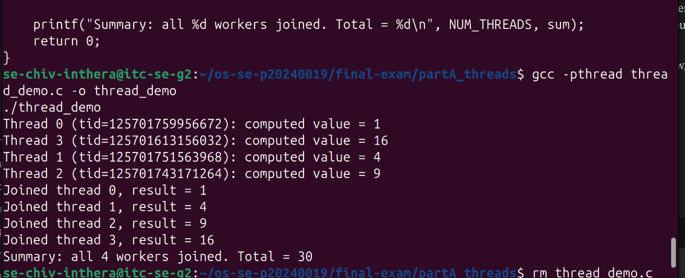
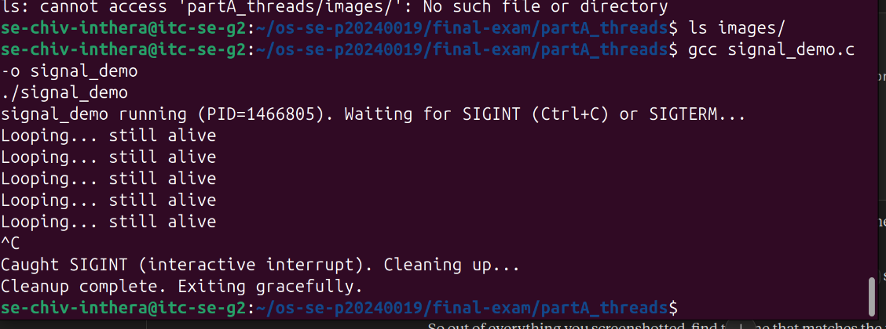
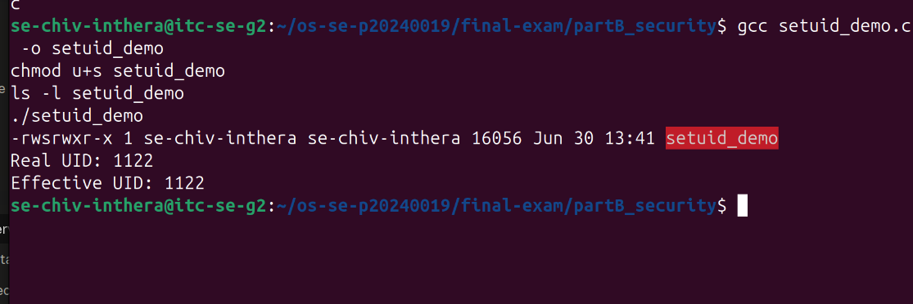
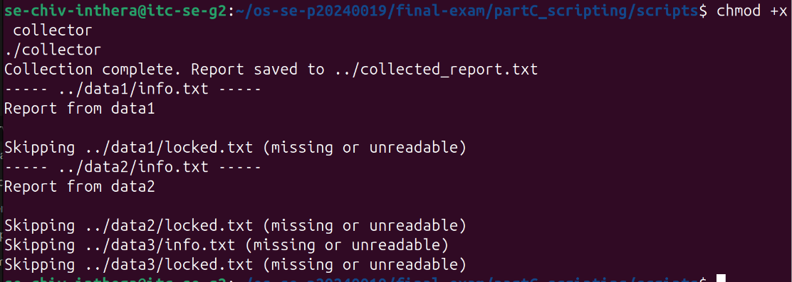
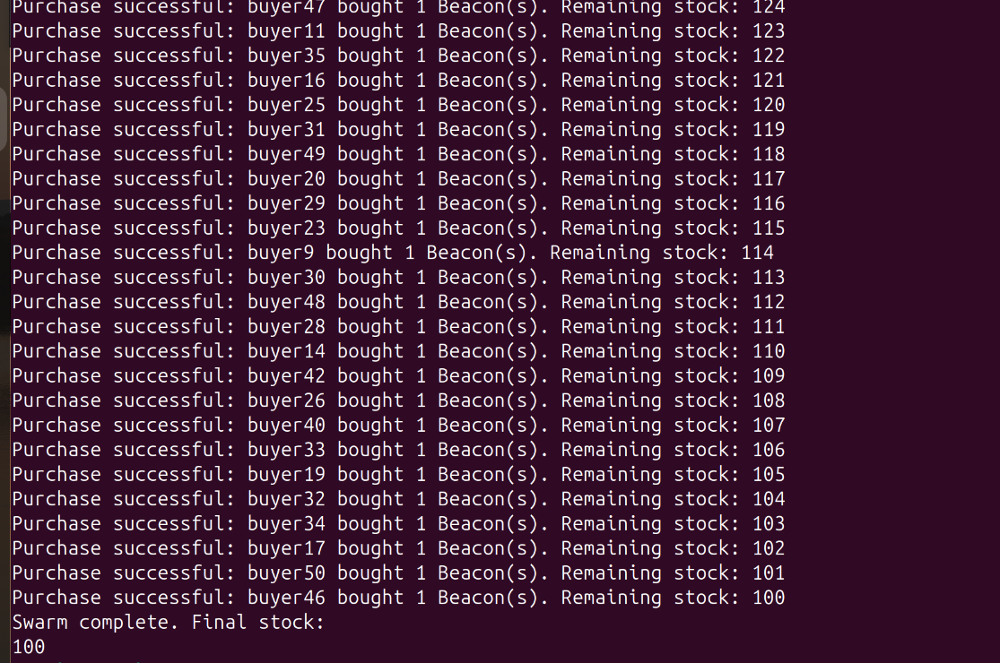
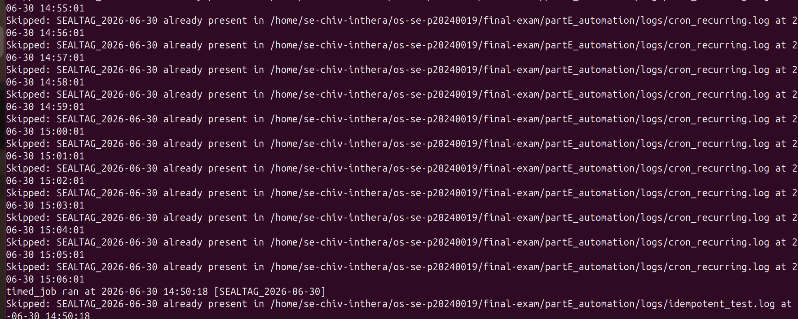

# Final Exam — <Your Name>

<!-- ===== COVER SHEET — required first section. Fill EVERY line. ===== -->
```
Student name: Chiv Inthera
Student ID: p20240019
Server username: se-chiv-inthera
Exam scenario value (COMPANY / PRODUCT): HelioGrid / Beacon
Date & start time: 2026-06-30, 1:30 PM (approx)
AI assistant used (name/none): Claude
```

> Exact commands per part are in `commands.md`. Live-curveball answers are in `live_mods.md`.
> Replace every `<...>` below. Keep answers tied to **your own** scenario numbers.

---

## Part A — Threads, Kernel Mapping & Signals

**Screenshots**




**Written (one short answer)**

- A worker thread created with pthread_create shares the same address space as
the main thread, so when it calls pthread_exit() with a pointer to heap
memory, pthread_join() in main can directly read that same memory. A forked
child gets its own separate copy of memory (copy-on-write), so the parent
cannot directly read any value the child computes without explicit IPC
(pipes, shared memory, etc).

**Anything not completed:** <none / ...>

---

## Part B — Files, Permissions & Special Bits

**Screenshot**



**Written (one short answer)**

- **Translate your private file's final octal mode into the 9-char symbolic string**
  (e.g. `600` → `rw-------`).
  octal `<NNN>` → `<rwx-style>`
600 → rw-------

**Anything not completed:** <none / ...>

---

## Part C — Bash Scripting, PATH & Safe File Scanning

**Screenshot**



**Written (one short answer)**

- Before adding ~/bin to PATH, bash only searches the directories listed in
$PATH when a command is typed by name. Since ~/bin wasn't in that list, the
shell couldn't find greeter even though the file existed and was executable
— it would only run via an explicit path like ./greeter.

**Anything not completed:** <none / ...>

---

## Part D — Concurrency, a Race Condition & File Locking

**Screenshot**



**Written (one short answer)**

- The unpatched swarm allowed multiple buy_beacon processes to read the same
current_stock value before any of them wrote back their decrement. When one
process's write overwrote another's, some decrements were lost, leaving
stock higher than the correct value of 100.
**Anything not completed:** <note here if the race was hard to reproduce — D3's lock is
what's graded>

---

## Part E — Backups, Archiving & cron Automation

**Screenshot**



**Written (one short answer)**

- **Archiving vs compression — which one actually shrank the bytes, and why?**
  Compression (the gzip -z flag) is what actually shrinks the bytes —
archiving (tar alone) just bundles files into one container without
reducing size. The size reduction comes entirely from gzip's compression
algorithm finding and encoding redundancy in the data.

**Anything not completed:** <none / ...>
