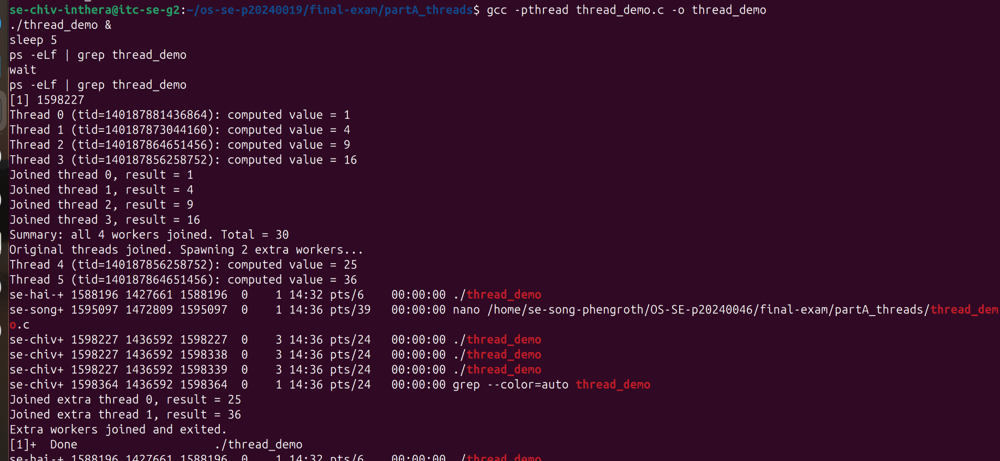
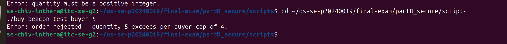
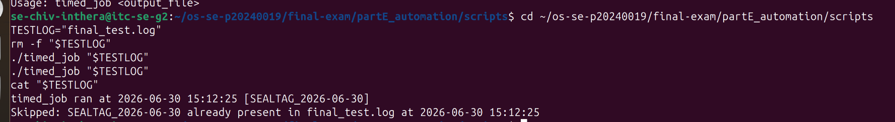

# live_mods.md — Live Modification (curveball) answers

> Released once, late in the exam. **Three curveballs: A, D, E.** For EACH, give: the
> announced instruction, the exact command(s) you ran, the **live value(s)** you acted
> on (your PID / stock / timestamp), and the screenshot. An answer that ignores your
> issued value, or that could have been written *before* the announcement, scores zero.

---

## Curveball A — extra worker(s) that start after the others join

- **Issued value:** `<N>` extra worker(s)
- **Announced instruction:** <paste exactly what was announced>
- **Live value(s) I acted on:** base PID = `<...>`; new LWP id(s) that appeared = `<...>`
- **Commands:**

```bash
# edit thread_demo.c to spawn N extra workers only AFTER the originals join
# recompile, run, and capture the mapping showing the new LWP(s) appear then vanish
# edit thread_demo.c to spawn N extra workers only AFTER the originals join
# recompile, run, and capture the mapping showing the new LWP(s) appear then vanish
nano thread_demo.c
gcc -pthread thread_demo.c -o thread_demo
./thread_demo &
sleep 5
ps -eLf | grep thread_demo
wait
ps -eLf | grep thread_demo
```

- **Screenshot:**



---

## Curveball D — per-buyer purchase cap

- **Issued value:** cap = `<N>`
- **Announced instruction:** <paste>
- **Live value(s) I acted on:** stock before = `<...>`; order(s) rejected for exceeding
  the cap = `<...>`; final stock = `<...>`
- **Commands:**

```bash
# add a per-buyer cap to buy_<product>: reject any single order above <N>
# reset stock, re-run swarm, show it stays consistent AND respects the cap
## Curveball D
Instruction: Add a per-buyer purchase cap to buy_beacon. Reject any single 
order above the cap; re-run swarm and show the locked result respects the 
cap and stays consistent.
My value: cap = 4

Commands run:
nano buy_beacon   # added PURCHASE_CAP=4 check before the flock block
chmod +x buy_beacon
echo "150" > ../stock.txt
./buy_beacon TestBuyer 5    # rejected — exceeds cap
./buy_beacon TestBuyer 4    # accepted — at cap
echo "150" > ../stock.txt
./swarm                     # final stock = 100, consistent

Screenshot: live_d.png
```

- **Screenshot:**



---

## Curveball E — idempotent timed_job

- **Issued value:** token = `<TOKEN>`
- **Announced instruction:** <paste>
- **Live value(s) I acted on:** today's marker line = `<...>`; 1st trigger = ran,
  2nd trigger = skipped
- **Commands:**

```bash
# add a guard to timed_job: refuse to run if today's <TOKEN> entry is already in the log
# trigger it twice and show the 2nd run was skipped
### Curveball E
- **Issued Value:** SEALTAG idempotency.
- **Commands Ran:** `./timed_job "$TESTLOG"`, `./timed_job "$TESTLOG"`, `cat "$TESTLOG"`
- **Live Values:** The script generated `SEALTAG_2026-06-30` on the first run, and grep successfully identified it to abort the second run.
- **Screenshot:** live_e.png
```

- **Screenshot:**


