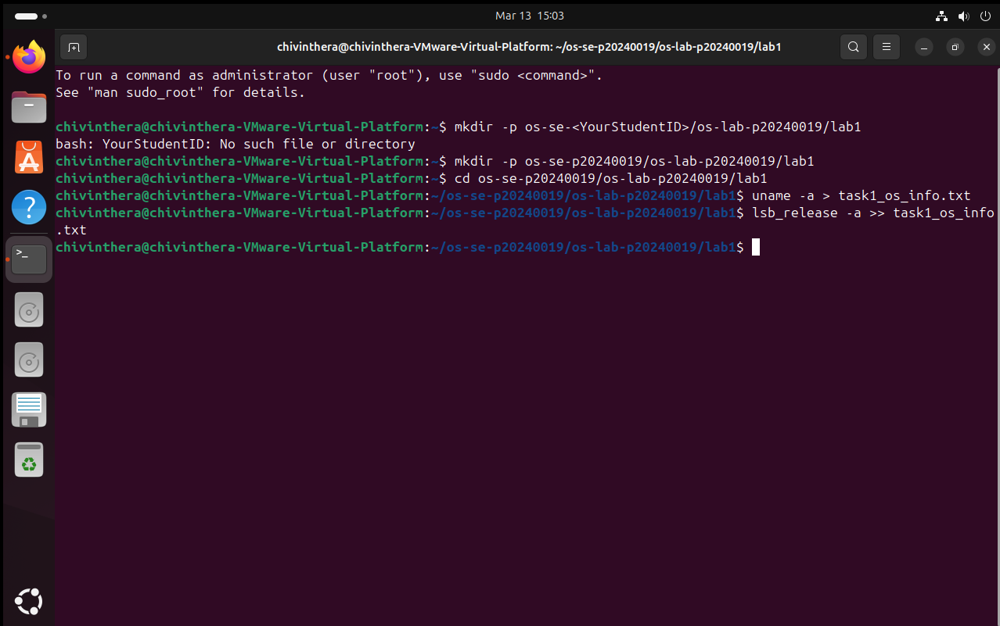
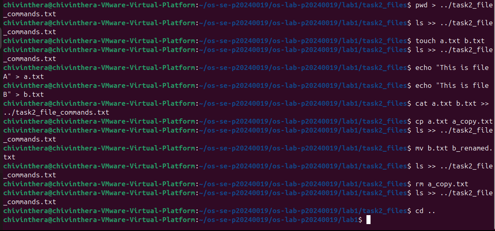
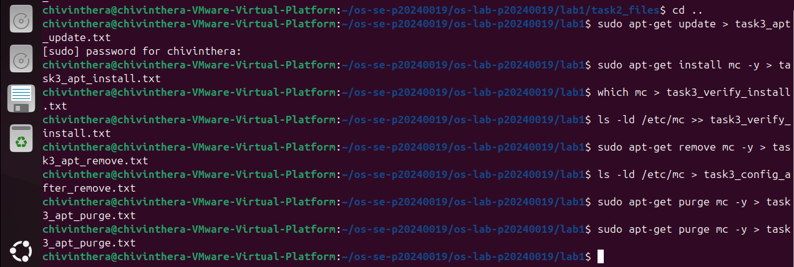
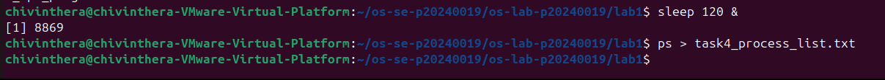
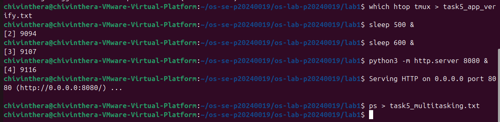
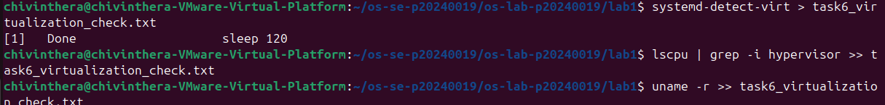

# OS Lab 1 Submission

- **Student Name:** Chiv Inthera
- **Student ID:** p20240019

---

## Task 1: Operating System Identification

Briefly describe what you observed about your OS and Kernel here.

I observed that my system is running Ubuntu on a 64-bit Linux kernel, hosted inside a VMware virtual machine. The uname -a command showed the kernel version and architecture, while lsb_release -a confirmed the Ubuntu distribution and release version.


---

## Task 2: Essential Linux File and Directory Commands

Briefly describe your experience creating, moving, and deleting files.

Using mkdir, touch, cp, mv, and rm was straightforward. I created a directory and files, copied and moved them around, then deleted them



---

## Task 3: Package Management Using APT

Explain the difference you observed between `remove` and `purge`.

remove uninstalls the package but keeps the configuration files, while purge uninstalls the package and deletes everything including config files




---

## Task 4: Programs vs Processes (Single Process)

Briefly describe how you ran a background process and found it in the process list.

I ran sleep 120 & to start a background process, then used ps to find it in the process list by its PID. The & symbol is what sends the process to the background.



---

## Task 5: Installing Real Applications & Observing Multitasking

Briefly describe the multitasking environment and the background web server.

I ran multiple background processes at the same time, including a sleep command and a python3 -m http.server web server. Using ps, I could see all processes running.



---

## Task 6: Virtualization and Hypervisor Detection

State whether your system is running on a virtual machine or physical hardware based on the command outputs.



```
C:.
└───os-lab-p20240019
    └───lab1
        │   README.md
        │   task1_os_info.txt
        │   task2_file_commands.txt
        │   task3_apt_install.txt
        │   task3_apt_purge.txt
        │   task3_apt_remove.txt
        │   task3_apt_update.txt
        │   task3_config_after_purge.txt
        │   task3_config_after_remove.txt
        │   task3_verify_install.txt
        │   task4_process_list.txt
        │   task5_app_verify.txt
        │   task5_multitasking.txt
        │   task6_virtualization_check.txt
        │
        ├───image
        │       task1.png
        │       task2.png
        │       task3.png
        │       task4.png
        │       task5.png
        │       task6.png
        │
        └───task2_files
                a.txt
                b_renamed.txt
```