# Class Activity 1 — System Calls in Practice

- **Student Name:** Chiv Inthera
- **Student ID:** p20240019
- **Date:**  19/03/2026

---

## Warm-Up: Hello System Call

Screenshot of running `hello_syscall.c` on Linux:

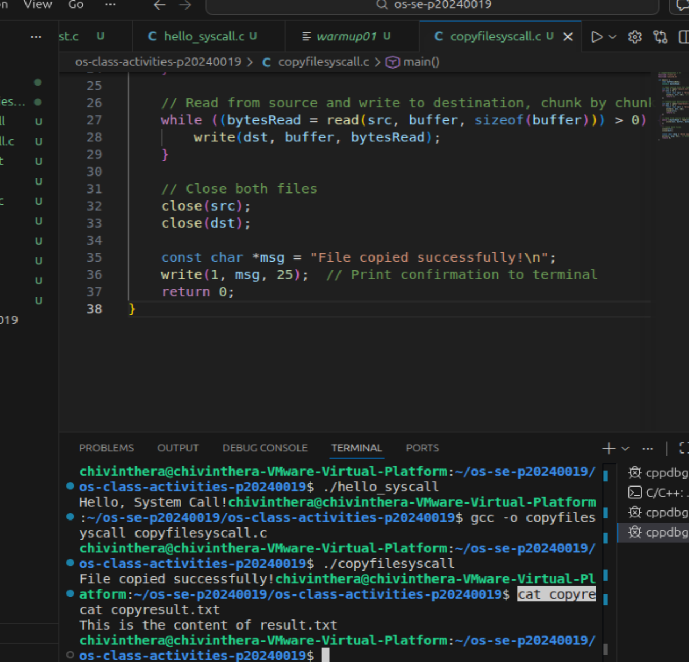

Screenshot of running `hello_winapi.c` on Windows (CMD/PowerShell/VS Code):

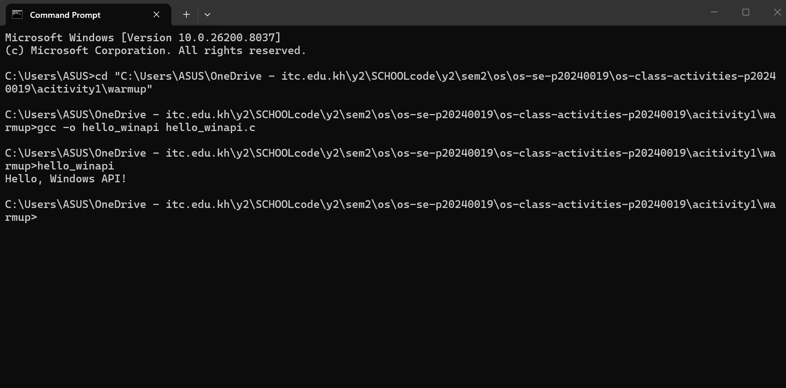

Screenshot of running `copyfilesyscall.c` on Linux:

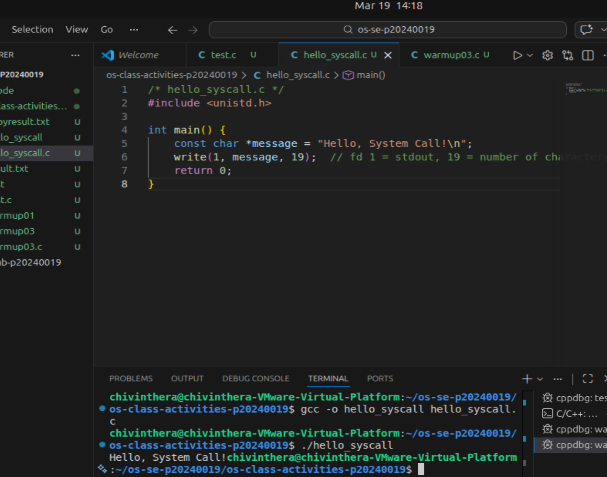

---

## Task 1: File Creator & Reader

### Part A — File Creator

**Describe your implementation:** [What differences did you notice between the library version and the system call version?]
>The library version using fopen() and fprintf() was easier to write. The syscall version using open() and write() was more work but I could see exactly what was happening. The main difference is the library handles buffering and flags automatically while syscall version I had to do everything manually.

**Version A — Library Functions (`file_creator_lib.c`):**

<!-- Screenshot: gcc -o file_creator_lib file_creator_lib.c && ./file_creator_lib && cat output.txt -->
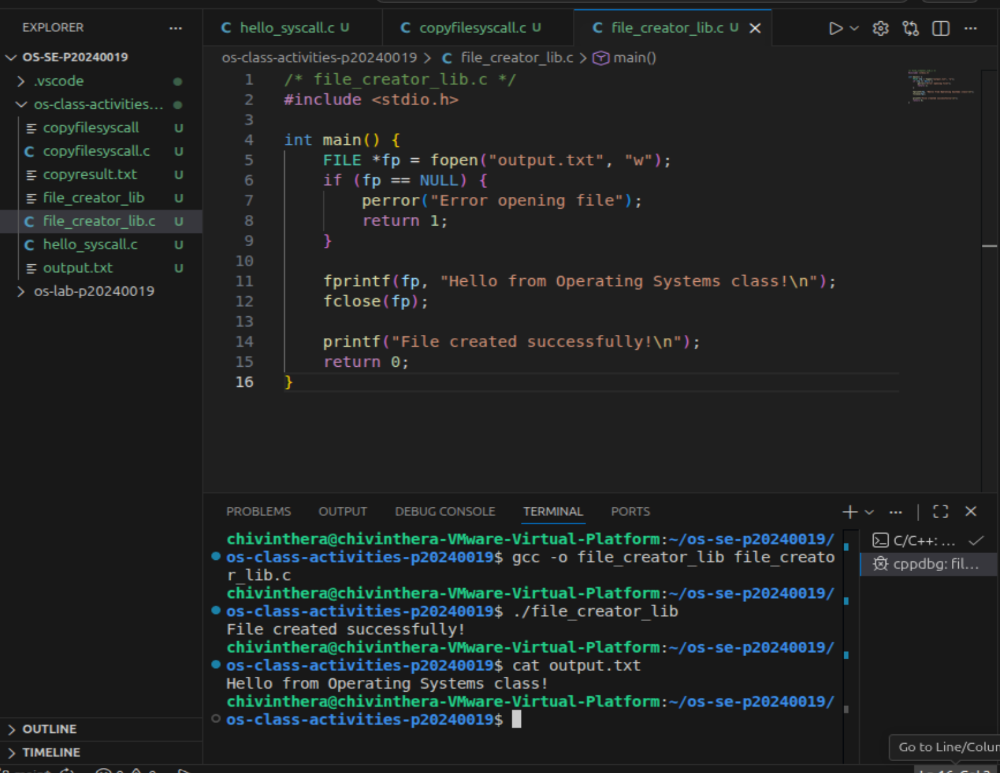

**Version B — POSIX System Calls (`file_creator_sys.c`):**

<!-- Screenshot: gcc -o file_creator_sys file_creator_sys.c && ./file_creator_sys && cat output.txt -->
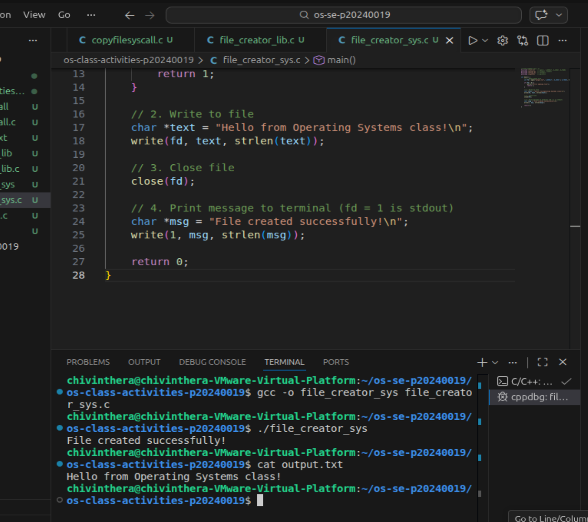

**Questions:**

1. **What flags did you pass to `open()`? What does each flag mean?**

   > O_WRONLY — open for writing only. O_CREAT — create the file if it doesn't exist. O_TRUNC — erase the file contents if it already exists.

2. **What is `0644`? What does each digit represent?**

   > It's an octal permission number. 0 = octal prefix. 6 (owner) = read + write. 4 (group) = read only. 4 (others) = read only.

3. **What does `fopen("output.txt", "w")` do internally that you had to do manually?**

   > It automatically calls open() with the right flags, sets up buffering, and returns a FILE*. Manually I had to call open(), write(), and close() myself with no buffering.

### Part B — File Reader & Display

**Describe your implementation:** 
> The library version used fgets() which reads line by line and was simple. The syscall version used read() which reads raw bytes so I needed a loop to keep reading until the file ended. Both gave the same result but the syscall version felt more low level.

**Version A — Library Functions (`file_reader_lib.c`):**

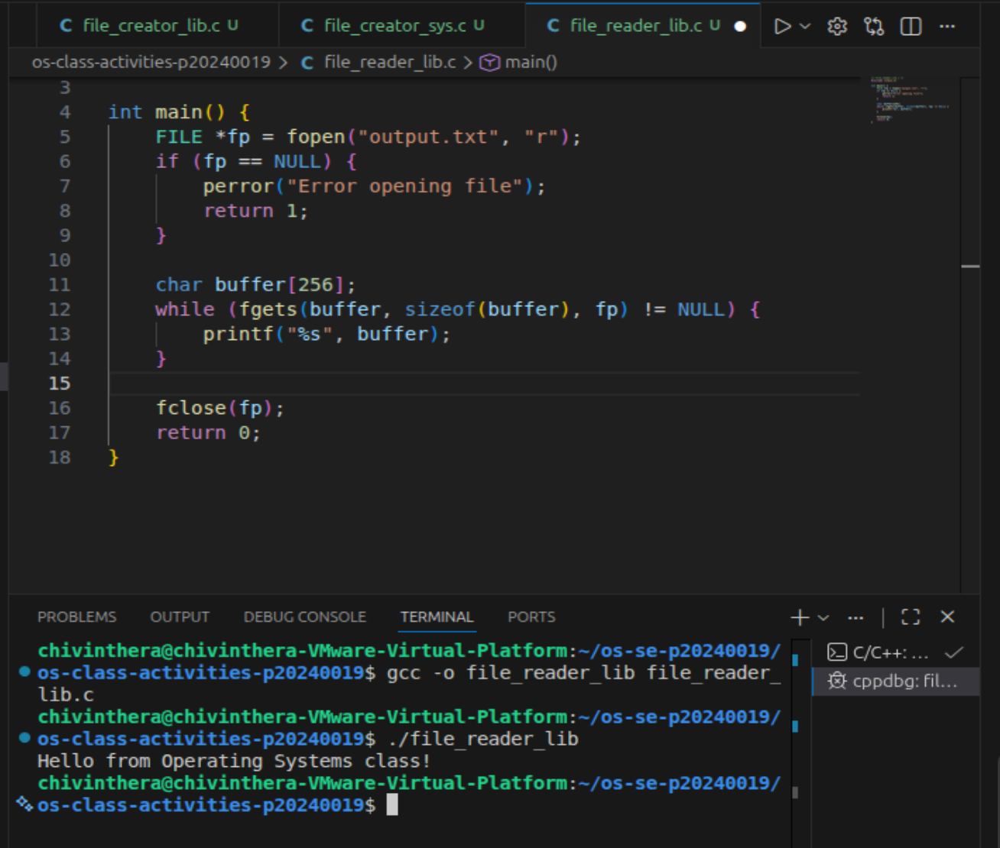

**Version B — POSIX System Calls (`file_reader_sys.c`):**

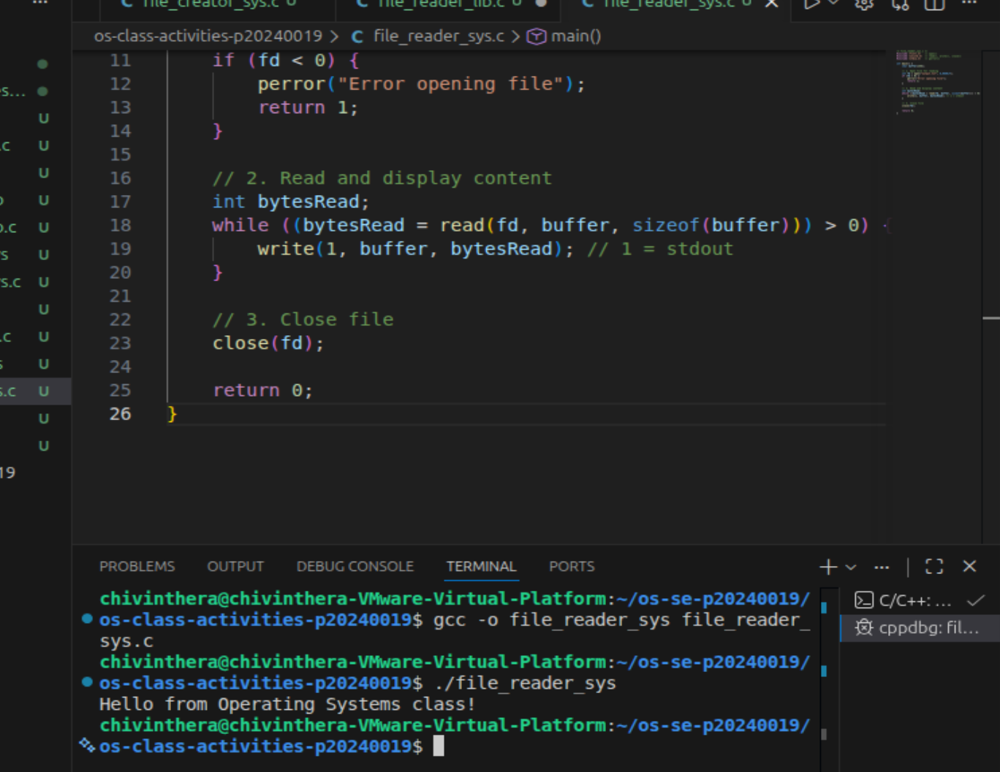

**Questions:**

1. **What does `read()` return? How is this different from `fgets()`?**

   > read() returns the number of bytes read, 0 at end of file, or -1 on error. fgets() reads one line at a time and returns a string pointer — it's higher level and stops at a newline.

2. **Why do you need a loop when using `read()`? When does it stop?**

   > read() only reads a chunk at a time — it may not get all the data in one call. The loop keeps reading until read() returns 0 (end of file).

---

## Task 2: Directory Listing & File Info

**Describe your implementation:** 
>The library version used opendir() and readdir() which was straightforward. The syscall version used getdents() and stat() directly which was harder but showed more detail about each file like permissions and size.

### Version A — Library Functions (`dir_list_lib.c`)

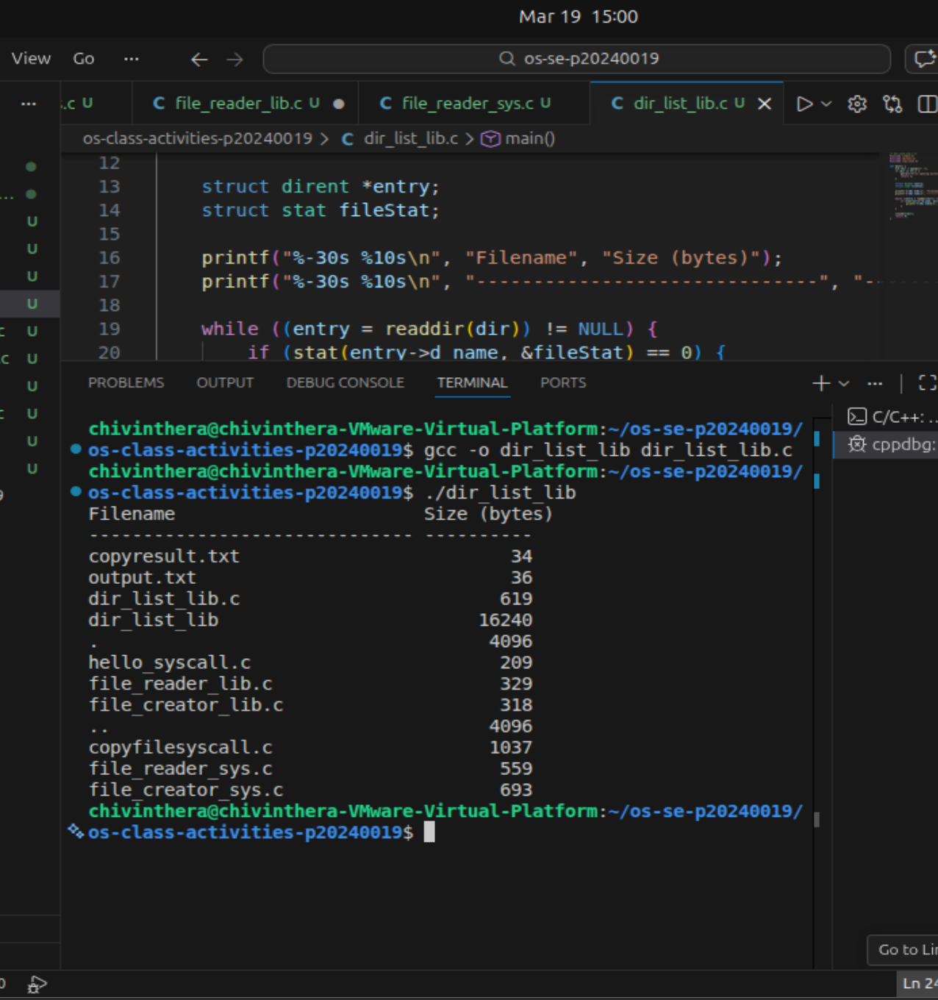

### Version B — System Calls (`dir_list_sys.c`)

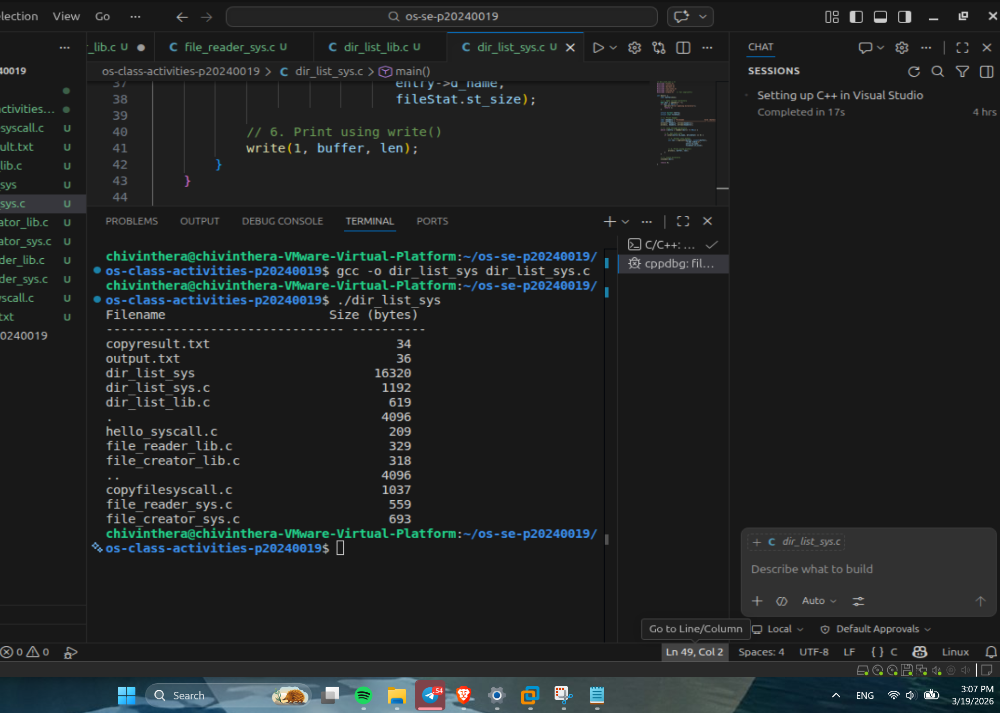

### Questions

1. **What struct does `readdir()` return? What fields does it contain?**

   > Returns struct dirent. Key fields: d_name (file name), d_ino (inode number), d_type (file or directory).

2. **What information does `stat()` provide beyond file size?**

   > File permissions, owner UID/GID, inode number, number of hard links, and last accessed/modified/changed timestamps.

3. **Why can't you `write()` a number directly — why do you need `snprintf()` first?**

   > write() sends raw bytes — it can't send an integer directly. snprintf() converts the number into a string first so write() can output it.

---

## Optional Bonus: Windows API (`file_creator_win.c`)

Screenshot of running on Windows:

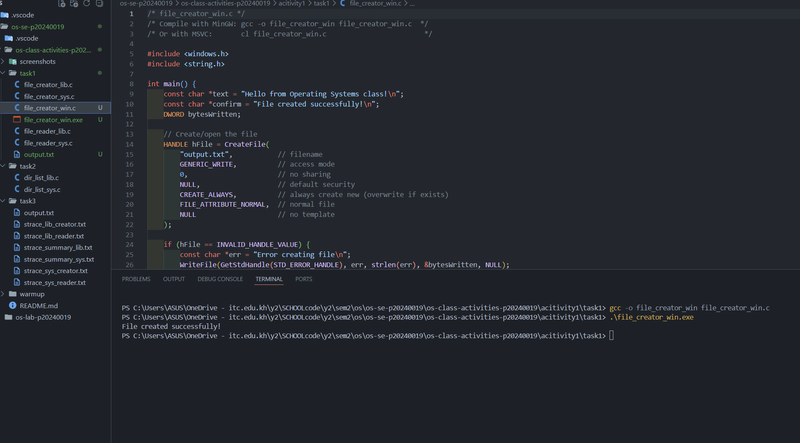

### Bonus Questions

1. **Why does Windows use `HANDLE` instead of integer file descriptors?**

   > HANDLE is a generic pointer that can represent files, threads, pipes, and more. It's more flexible than a plain integer and lets Windows manage many resource types the same way.

2. **What is the Windows equivalent of POSIX `fork()`? Why is it different?**

   > CreateProcess(). Unlike fork() which clones the current process, CreateProcess() always starts a brand new process from a separate executable.

3. **Can you use POSIX calls on Windows?**

   > Not natively. You need WSL (Windows Subsystem for Linux) or a compatibility layer like Cygwin to use POSIX calls on Windows.

---

## Task 3: strace Analysis

**Describe what you observed:** [What surprised you about the strace output? How many more system calls did the library version make?]
> The library version made a lot more system calls than I expected. The syscall version only made the calls I wrote myself. I was surprised that the library version triggered extra openat and read calls just to load libc.so before doing anything. The syscall version only made the calls I wrote myself.
### strace Output — Library Version (File Creator)

<!-- Screenshot: strace -e trace=openat,read,write,close ./file_creator_lib -->
<!-- IMPORTANT: Highlight/annotate the key system calls in your screenshot -->
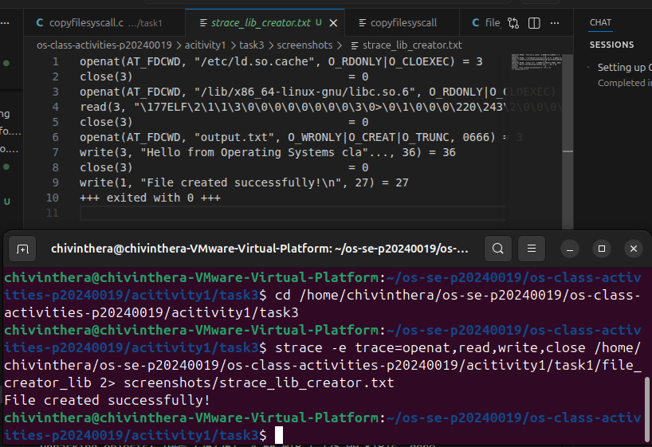

### strace Output — System Call Version (File Creator)

<!-- Screenshot: strace -e trace=openat,read,write,close ./file_creator_sys -->
<!-- IMPORTANT: Highlight/annotate the key system calls in your screenshot -->
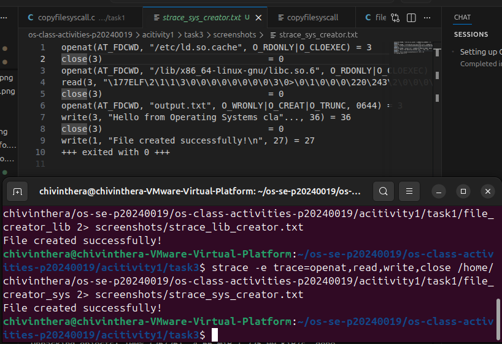

### strace Output — Library Version (File Reader or Dir Listing)

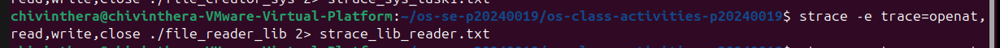

### strace Output — System Call Version (File Reader or Dir Listing)

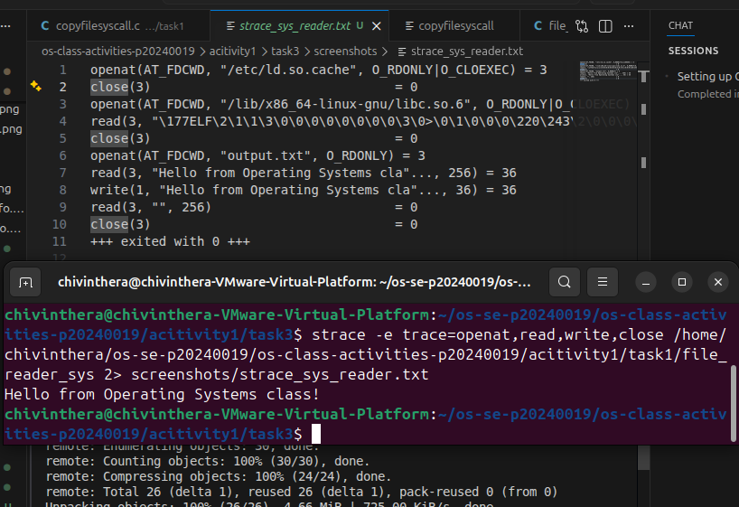

### strace -c Summary Comparison

<!-- Screenshot of `strace -c` output for both versions -->
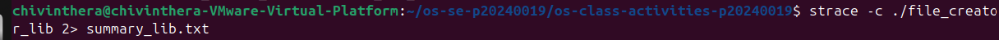
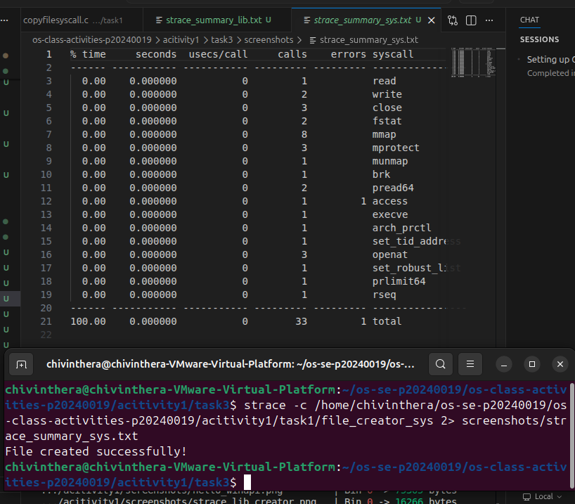

### Questions

1. **How many system calls does the library version make compared to the system call version?**

   > The library version makes around 30–50+ calls vs. around 5–10 for the syscall version. The extras come from the C library initializing itself.

2. **What extra system calls appear in the library version? What do they do?**

   > The library version showed extra openat and read calls to load libc.so.before the program even ran. These load the shared C library automatically. The syscall version had none of these — it only made the calls I wrote.

3. **How many `write()` calls does `fprintf()` actually produce?**

   > just one 
   ```write(3, "Hello from Operating Systems cla"..., 36) = 36```

4. **In your own words, what is the real difference between a library function and a system call?**

   > A library function runs in user space and adds convenience like  error handling. A system call is a direct request to the kernel. 

---

## Task 4: Exploring OS Structure

### System Information

> 📸 Screenshot of `uname -a`, `/proc/cpuinfo`, `/proc/meminfo`, `/proc/version`, `/proc/uptime`:

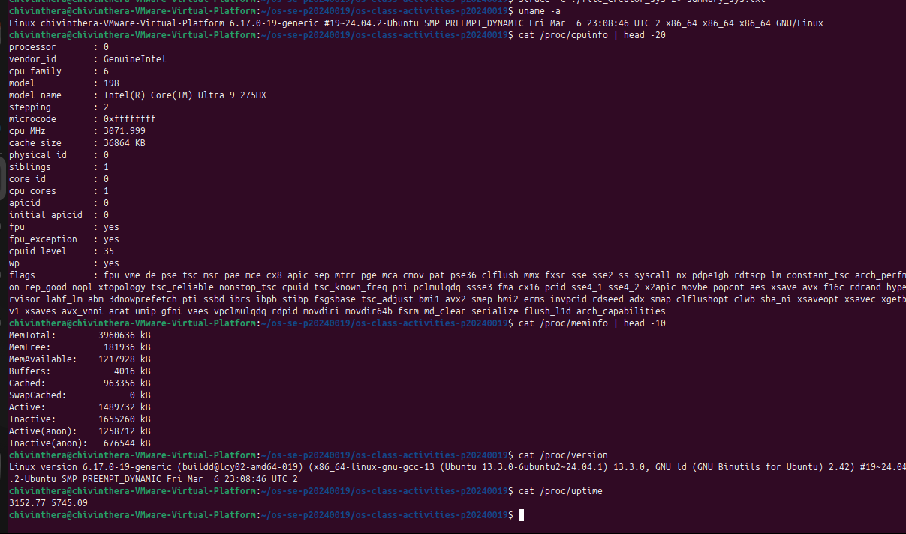

### Process Information

> 📸 Screenshot of `/proc/self/status`, `/proc/self/maps`, `ps aux`:

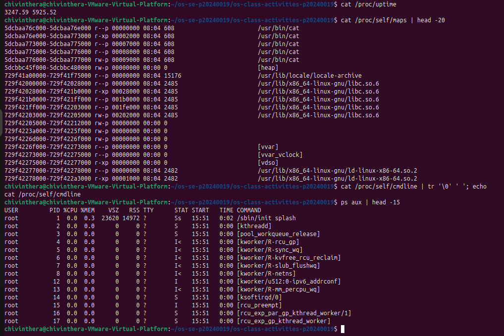

### Kernel Modules

> 📸 Screenshot of `lsmod` and `modinfo`:

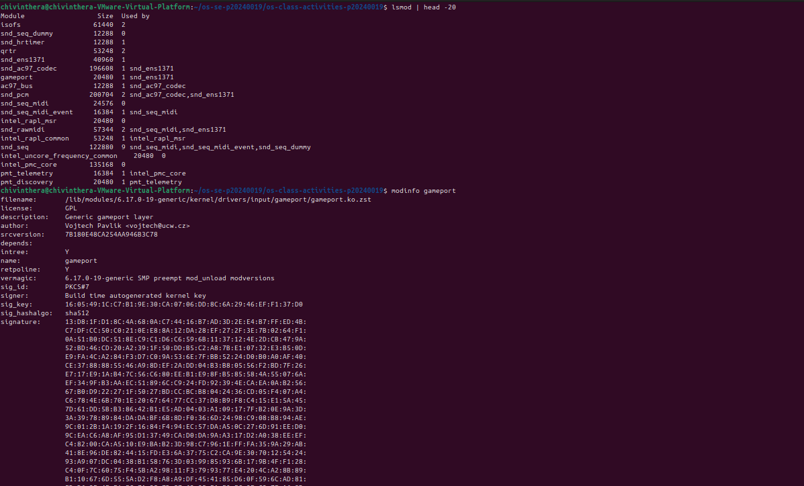

### OS Layers Diagram

> 📸 Your diagram of the OS layers, labeled with real data from your system:

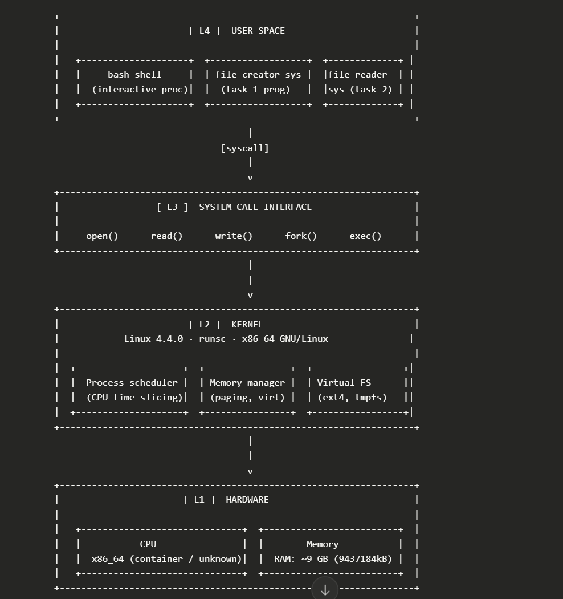

### Questions

1. **What is `/proc`? Is it a real filesystem on disk?**

   > /proc is a virtual filesystem. It is not on disk — the kernel generates it in memory to expose live info about processes, hardware, and the kernel.

2. **Monolithic kernel vs. microkernel — which type does Linux use?**

   > Linux uses a monolithic kernel. All core services like memory management, scheduling, and drivers run together in kernel space.

3. **What memory regions do you see in `/proc/self/maps`?**

   > Program code (text), heap, stack, shared libraries like libc, and memory-mapped files.

4. **Break down the kernel version string from `uname -a`.**

   > Linux runsc 4.4.0 #1 SMP Sun Jan 10 15:06:54 PST 2016 x86_64 — Linux = OS, runsc = hostname, 4.4.0 = kernel version, #1 SMP = build 1 with multi-CPU support, date = when it was compiled, x86_64 = 64-bit architecture.

5. **How does `/proc` show that the OS is an intermediary between programs and hardware?**

   > Programs read CPU and memory info through /proc without touching hardware directly. All access goes through the kernel — proving the OS sits between programs and hardware.

---

## Reflection

What did you learn from this activity? What was the most surprising difference between library functions and system calls?

> I learned that every time a program does something like read or write a file, it has to go through the OS kernel using system calls. Before this I didn't know the difference between library functions and system calls. Doing this activity hands-on made it click for me. I also learned that /proc shows real live info about my system which was cool to see. Overall it helped me understand how programs, the OS, and hardware are all connected.