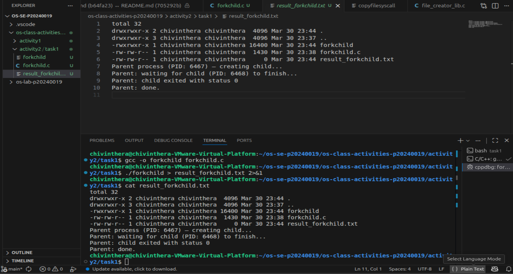
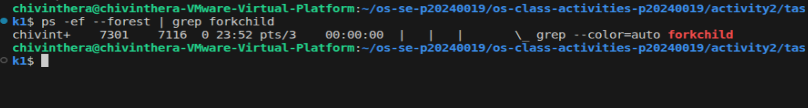
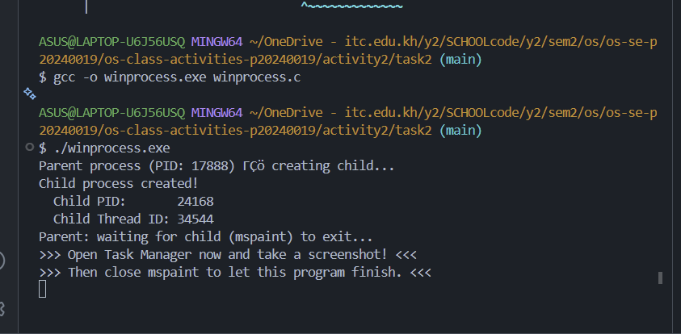
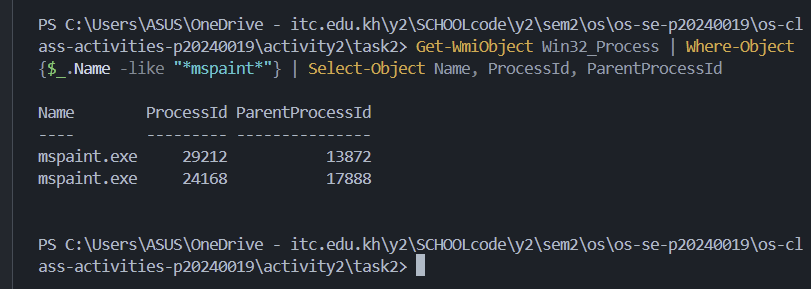
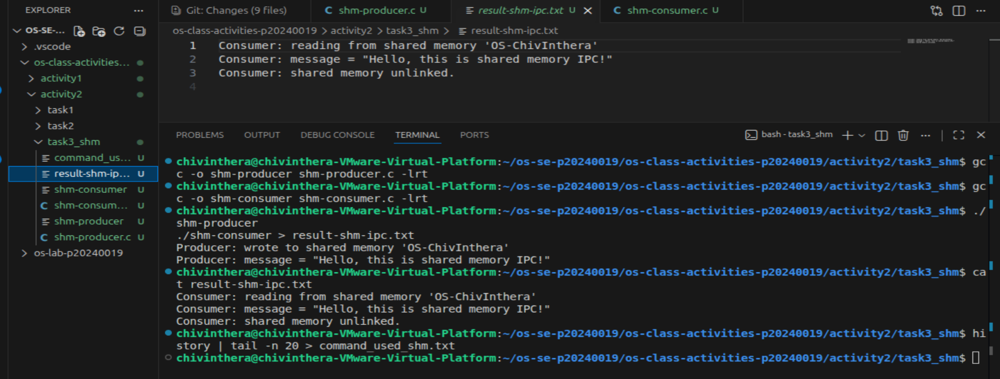
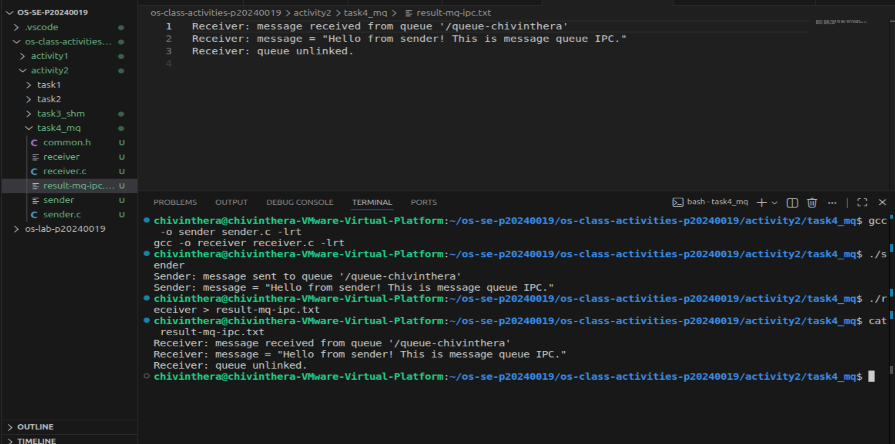

# Class Activity 2 — Processes & Inter-Process Communication

- **Student Name:** chiv inthera
- **Student ID:** p20240019
- **Date:** 31.04.2026

---

## Task 1: Process Creation on Linux (fork + exec)

### Compilation & Execution

Screenshot of compiling and running `forkchild.c`:



### Process Tree

Screenshot of the parent-child process tree (using `ps --forest`, `pstree`, or `htop` tree view):



### Output

```
total 32
drwxrwxr-x 2 chivinthera chivinthera  4096 Mar 30 23:44 .
drwxrwxr-x 3 chivinthera chivinthera  4096 Mar 30 23:37 ..
-rwxrwxr-x 1 chivinthera chivinthera 16400 Mar 30 23:44 forkchild
-rw-rw-r-- 1 chivinthera chivinthera  1430 Mar 30 23:38 forkchild.c
-rw-rw-r-- 1 chivinthera chivinthera     0 Mar 30 23:44 result_forkchild.txt
Parent process (PID: 6467) — creating child...
Parent: waiting for child (PID: 6468) to finish...
Parent: child exited with status 0
Parent: done.

```

### Questions

1. **What does `fork()` return to the parent? What does it return to the child?**

   > To the parent: returns the child's PID — in your case, 6468
   > To the child: returns 0
   > If it fails, it returns -1

2. **What happens if you remove the `waitpid()` call? Why might the output look different?**

   >  Without waitpid(), the parent won't wait for the child to finish, potentially causing zombie processes and unpredictable output order.

3. **What does `execlp()` do? Why don't we see "execlp failed" when it succeeds?**

   > [Your answer]

4. **Draw the process tree for your program (parent → child). Include PIDs from your output.**

   > execlp() replaces the child process with a new program (ls), so any code after it is destroyed and never reached on success.
   ```
   bash (7116)
  └── forkchild (6467)        ← Parent process
        └── child (6468)      ← Created by fork()
              └── ls -l       ← Replaced child via execlp()
   ```


5. **Which command did you use to view the process tree (`ps --forest`, `pstree`, or `htop`)? What information does each column show?**

   >  I used ps -ef --forest, where columns show UID (owner), PID (process ID), PPID (parent ID), C (CPU%), STIME (start time), TTY (terminal), TIME (CPU time used), and CMD (command name).

---

## Task 2: Process Creation on Windows

### Compilation & Execution

Screenshot of compiling and running `winprocess.c`:



### Task Manager Screenshots

Screenshot showing process tree in the **Processes** tab (mspaint nested under your program):


Screenshot showing PID and Parent PID in the **Details** tab:



### Questions

1. **What is the key difference between how Linux creates a process (`fork` + `exec`) and how Windows does it (`CreateProcess`)?**

   > Linux uses two separate steps — fork() creates a copy of the parent process, then exec() replaces it with a new program — while Windows combines both into one single CreateProcess() call that creates and launches the new process directly without cloning the parent first.

2. **What does `WaitForSingleObject()` do? What is its Linux equivalent?**

   > WaitForSingleObject() pauses the parent process and makes it wait until the child process (mspaint) finishes before continuing — its Linux equivalent is waitpid(), which does the same thing but for processes created with fork().

3. **Why do we need to call `CloseHandle()` at the end? What happens if we don't?**

   > CloseHandle() releases the handle resources that Windows gave us when we created the process — if we don't call it, those handles stay open and waste memory (a resource leak), even after the child process has already exited.

4. **In Task Manager, what was the PID of your parent program and the PID of mspaint? Do they match your program's output?**

   > Parent PID: 17888 (winprocess.exe)
   > Child mspaint PID: 24168
   > PowerShell confirmed mspaint.exe (24168) has ParentProcessId: 17888, which is what my program printed.

5. **Compare the Processes tab (tree view) and the Details tab (PID/PPID columns). Which view makes it easier to understand the parent-child relationship? Why?**

   > The tree view (Processes tab) makes the parent-child relationship easier to understand because it visually shows mspaint nested under Paint as a child, while the Details tab just lists flat rows of PIDs and PPIDs that you have to manually match together — the tree view lets you see the relationship instantly at a glance.

---

## Task 3: Shared Memory IPC

### Compilation & Execution

Screenshot of compiling and running `shm-producer` and `shm-consumer`:



### Output

```
Consumer: reading from shared memory 'OS-ChivInthera'
Consumer: message = "Hello, this is shared memory IPC!"
Consumer: shared memory unlinked.
```

### Questions

1. **What does `shm_open()` do? How is it different from `open()`?**

   > shm_open() creates or opens a shared memory object in RAM that multiple processes can access — unlike open() which opens a file on disk, shm_open() works entirely in memory, making it much faster since there's no disk I/O involved.

2. **What does `mmap()` do? Why is shared memory faster than other IPC methods?**

   >  mmap() maps the shared memory object into the process's virtual address space so the program can read/write it like a normal variable — shared memory is faster than other IPC methods like pipes or sockets because processes access the same memory directly without copying data through the kernel.

3. **Why must the shared memory name match between producer and consumer?**

   > The shared memory name 'OS-ChivInthera' acts like an address — both producer and consumer must use the exact same name so the OS knows to connect them to the same memory region, just like two people needing the same room number to meet in the same place

4. **What does `shm_unlink()` do? What would happen if the consumer didn't call it?**

   > shm_unlink() removes the shared memory object from the system — if the consumer didn't call it, the shared memory would stay allocated in the system even after both programs exit, wasting memory until the system reboots.

5. **If the consumer runs before the producer, what happens? Try it and describe the error.**

   >  If the consumer runs before the producer, shm_open() in the consumer would fail because the shared memory object doesn't exist yet — you would see an error like shm_open: No such file or directory and the consumer would exit without reading anything.

---

## Task 4: Message Queue IPC

### Compilation & Execution

Screenshot of compiling and running `sender` and `receiver`:



### Output

```
Receiver: message received from queue '/queue-chivinthera'
Receiver: message = "Hello from sender! This is message queue IPC."
Receiver: queue unlinked.
```

### Questions

1. **How is a message queue different from shared memory? When would you use one over the other?**

   > A message queue sends discrete, structured messages one at a time with built-in boundaries, while shared memory is just a raw block of memory both processes read/write freely — use a message queue when you need organized, ordered messages between processes, and use shared memory when you need maximum speed and are sharing large amounts of data continuously.

2. **Why does the queue name in `common.h` need to start with `/`?**

   > The / prefix is required by the POSIX standard so the OS can recognize it as a system-wide named object — just like your queue /queue-chivinthera, the leading slash tells the kernel this is a global name that any process on the system can find and connect to.

3. **What does `mq_unlink()` do? What happens if neither the sender nor receiver calls it?**

   > mq_unlink() removes the message queue from the system — if neither sender nor receiver calls it, the queue stays open and occupies kernel memory even after both programs exit, and it will still exist the next time you run the program which could cause unexpected behavior.

4. **What happens if you run the receiver before the sender?**

   >  If the receiver runs before the sender, mq_open() in the receiver will fail because the queue hasn't been created yet — you would get an error like mq_open: No such file or directory and the receiver would exit without receiving any message.


5. **Can multiple senders send to the same queue? Can multiple receivers read from the same queue?**

   > Yes, multiple senders can send to the same queue and their messages will be stored in order however, with multiple receivers, each message can only be read once by one receiver, so messages get split between them rather than all receivers seeing all messages.

---

## Reflection

What did you learn from this activity? What was the most interesting difference between Linux and Windows process creation? Which IPC method do you prefer and why?

>I learned how operating systems create and manage processes, and how processes can communicate with each other. The most interesting difference between Linux and Windows process creation was that Linux uses two separate steps — fork() then exec() — while Windows does everything in one single CreateProcess() call, which felt simpler but less flexible