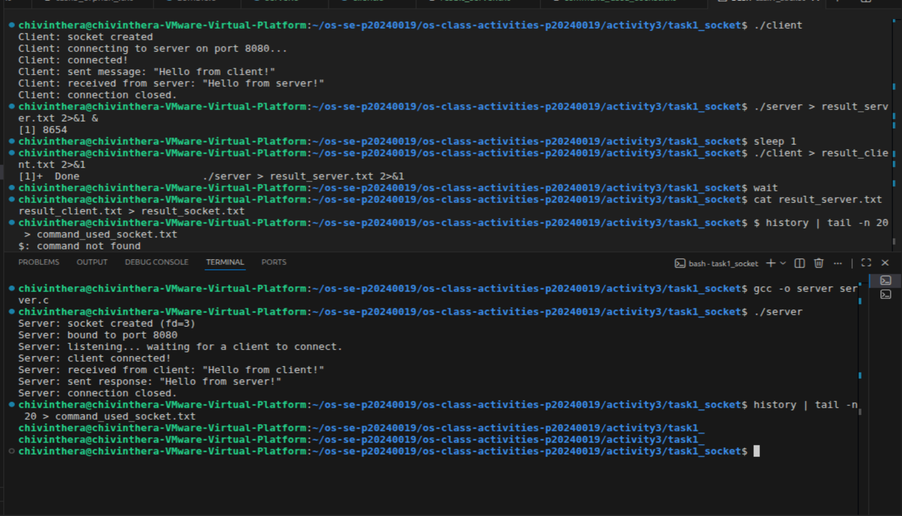
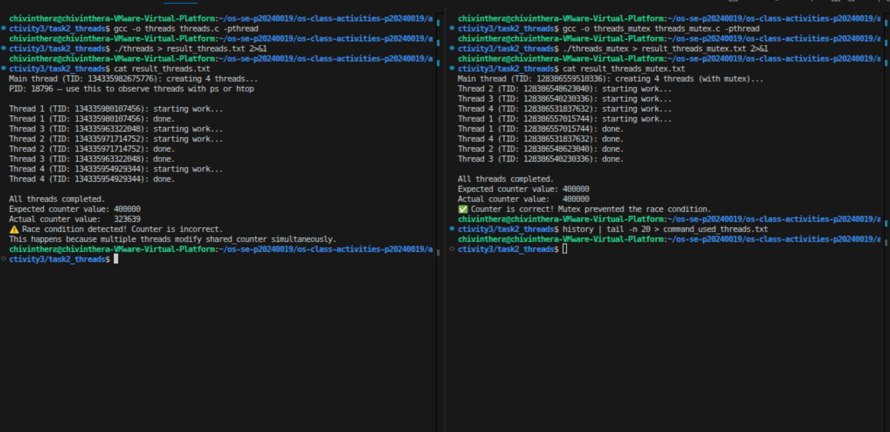
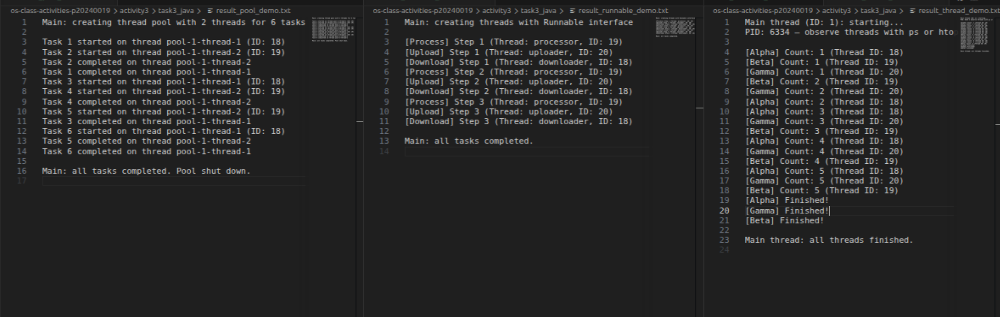
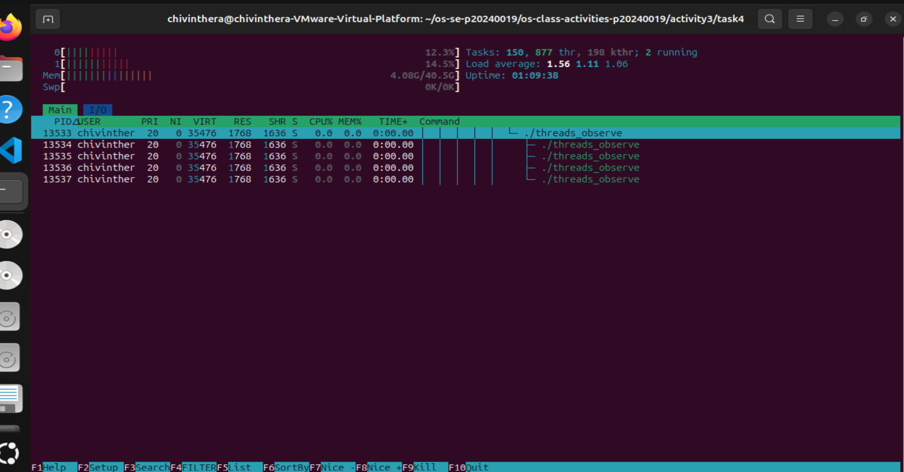
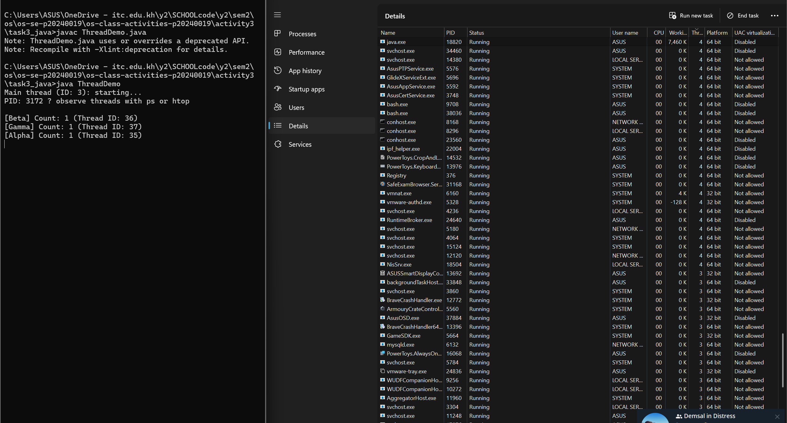

# Class Activity 3 — Socket Communication & Multithreading

- **Student Name:** ChivInthera
- **Student ID:** p20240019
- **Date:** 02/04/2026

---

## Task 1: TCP Socket Communication (C)

### Compilation & Execution



### Answers

1. **Role of `bind()` / Why client doesn't call it:**
   >bind() assigns a specific port number to the server socket (port 8080), so clients know where to connect. The client doesn't call bind() because it doesn't need a fixed port — the OS automatically assigns it a random available port when it connects.

2. **What `accept()` returns:**
   > accept() returns a new socket file descriptor for the connected client. In my output, the server printed "client connected!" after accept() succeeded, meaning it returned a new fd used to communicate with that specific client.

3. **Starting client before server:**
   > The connection would fail. my client output shows "connecting to server on port 8080..." — if the server isn't listening yet, there is nothing to connect to and the client would get a "Connection refused" error.

4. **What `htons()` does:**
   > htons() converts the port number (8080) from the host's byte order to network byte order (big-endian). This ensures the port number is correctly interpreted across different machines.

5. **Socket call sequence diagram:**

 ```
   SERVER                          CLIENT
  |                               |
socket()                        socket()
  |                               |
bind()                            |
  |                               |
listen()                          |
  |                               |
accept() <----- connect() --------+
  |              
  |                               |
recv() <------- send() ----------+
  |          "Hello from client!" |
  |                               |
send() ------> recv() -----------+
  |          "Hello from server!" |
  |                               |
close()                         close()
  |                               |
```

---

## Task 2: POSIX Threads (C)

### Output — Without Mutex (Race Condition)



### Output — With Mutex (Correct)

_(Include in the same screenshot or a separate one)_

### Answers

1. **What is a race condition?**
   >A race condition occurs when multiple threads access and modify shared data simultaneously, producing incorrect results. In my output, threads.c without mutex got 323639 instead of the expected 400000 because multiple threads were modifying shared_counter at the same time.

2. **What does `pthread_mutex_lock()` do?**
   >It locks the mutex so only one thread can access the shared counter at a time. Other threads must wait until the lock is released with pthread_mutex_unlock(). In my threads_mutex.c output, the counter was correctly 400000 because the mutex prevented simultaneous access.

3. **Removing `pthread_join()`:**
   
   > The main thread would exit before the worker threads finish, terminating the entire program. You would get incomplete or no output, threads would be killed before they complete their work.

4. **Thread vs Process:**
   > Threads share the same memory space within a process, which is why the race condition happened — all 4 threads shared the same shared_counter. Processes have separate memory spaces and cannot accidentally overwrite each other's data like threads can.

---

## Task 3: Java Multithreading

### ThreadDemo Output



### RunnableDemo Output

_(Include output or screenshot)_

### PoolDemo Output

_(Include output or screenshot)_

### Answers

1. **Thread vs Runnable:**
   > Runnable is an interface that defines a task to be run, while Thread is a class that executes it. In result_runnable_demo.txt, i used Runnable to create named tasks like "processor", "uploader", and "downloader" — this is preferred because Java only allows single inheritance, so implementing Runnable lets  class extend other classes too.

2. **Pool size limiting concurrency:**
   > Yes. In i result_pool_demo.txt, icreated a pool of only 2 threads for 6 tasks. i can see only Task 1 and Task 2 ran simultaneously — Tasks 3, 4, 5, 6 had to wait until a thread became free. The pool size directly controls how many tasks run at the same time.

3. **thread.join() in Java:**
   > join() makes the main thread wait until the specified thread finishes. In your result_thread_demo.txt, "Main thread: all threads finished." only printed after Alpha, Beta, and Gamma all completed — because join() was called on each thread.

4. **ExecutorService advantages:**
   > ExecutorService manages a pool of reusable threads automatically, avoiding the overhead of creating and destroying threads for each task. I output, only 2 threads handled all 6 tasks efficiently by reusing thread-1 and thread-2 repeatedly instead of creating 6 separate threads.

---

## Task 4: Observing Threads

### Linux — `ps -eLf` Output

```
UID        PID  PPID   LWP  C NLWP STIME TTY      TIME     CMD
chivint+  8638  4275  8638  0    5 17:34 pts/0    00:00:00 ./threads_observe
chivint+  8638  4275  8640  0    5 17:34 pts/0    00:00:00 ./threads_observe
chivint+  8638  4275  8641  0    5 17:34 pts/0    00:00:00 ./threads_observe
chivint+  8638  4275  8642  0    5 17:34 pts/0    00:00:00 ./threads_observe
chivint+  8638  4275  8643  0    5 17:34 pts/0    00:00:00 ./threads_observe
--- /proc/11066/task/ listing ---
11066
11067
11068
11069
11070
```

### Linux — htop Thread View



### Windows — Task Manager



### Answers

1. **LWP column meaning:**
   > LWP stands for Light Weight Process. It shows the thread ID (TID) of each individual thread, which is how the OS identifies and schedules each thread separately.

2. **/proc/PID/task/ count:**
   >The folder showed 5 entries — 1 for the main thread and 4 for the worker threads. Each thread gets its own directory named after its TID.

3. **Extra Java threads:**
   > Java creates extra threads automatically in the background for garbage collection, JVM internal management, and other runtime tasks. That is why the thread count in Task Manager was higher than the 3 threads created in the code.


4. **Linux vs Windows thread viewing:**
   > On Linux, threads can be observed using ps, htop, and /proc/PID/task/ which gives low level detail. On Windows, Task Manager shows thread counts but with less detail. Linux gives more direct access to thread information at the OS level.


---

## Reflection

> What I found interesting was seeing how threads can cause wrong results when they share data at the same time. Without a mutex, the counter gave the wrong number. Knowing how threads work at the OS level helps because you understand why you need locks and how to avoid bugs in programs that run multiple tasks at once.
