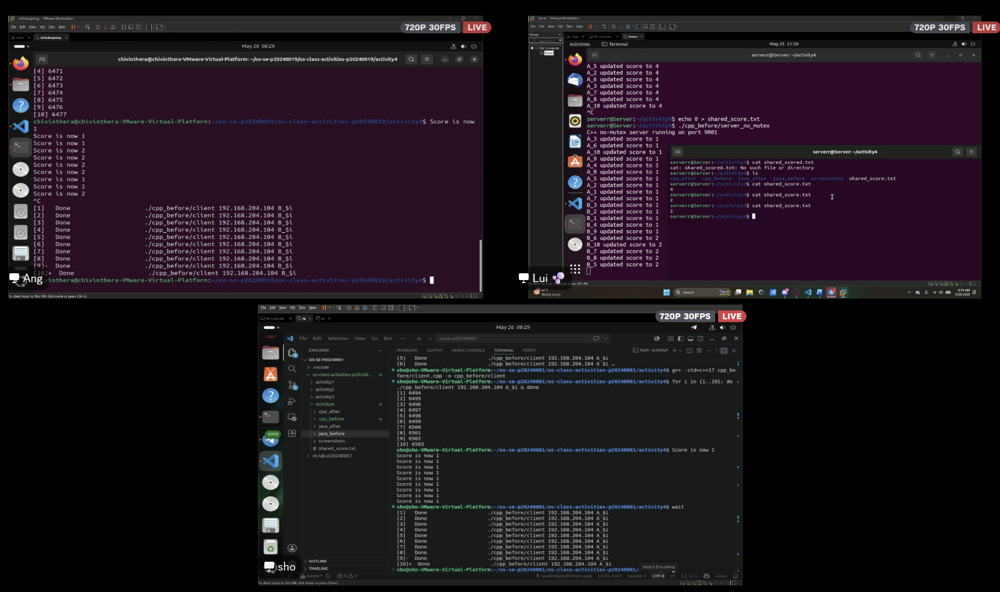
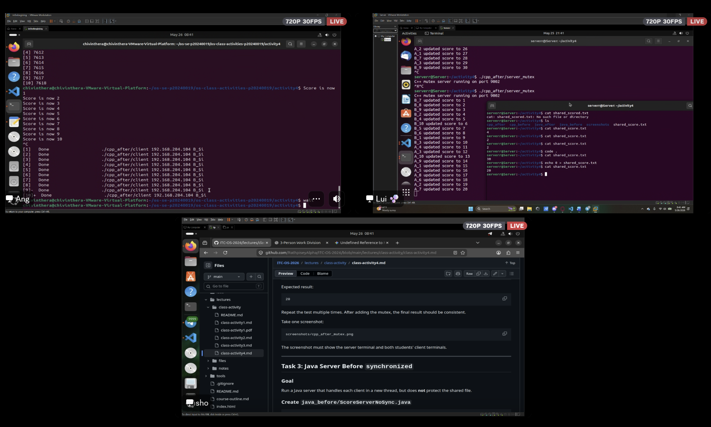
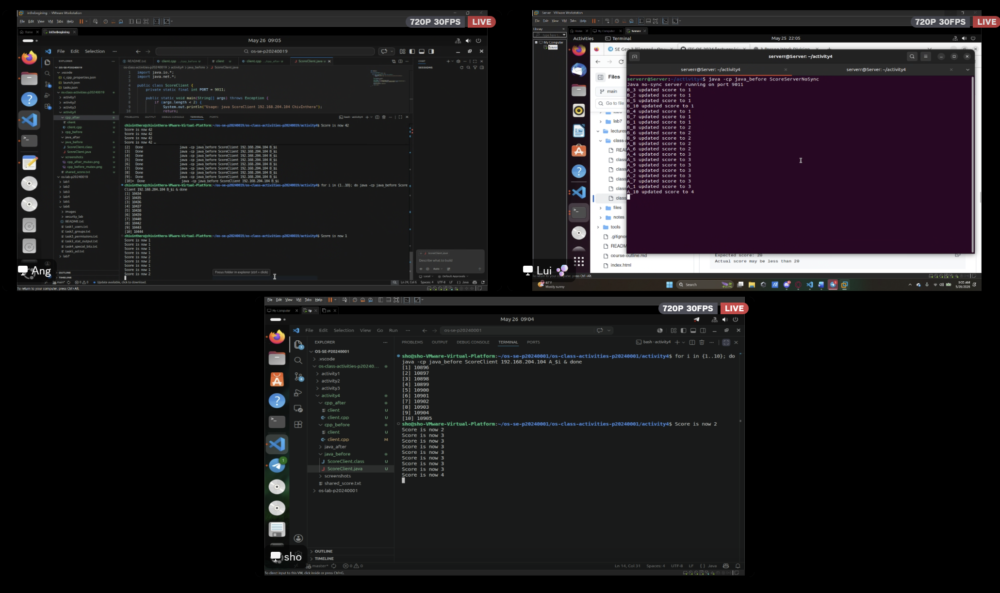
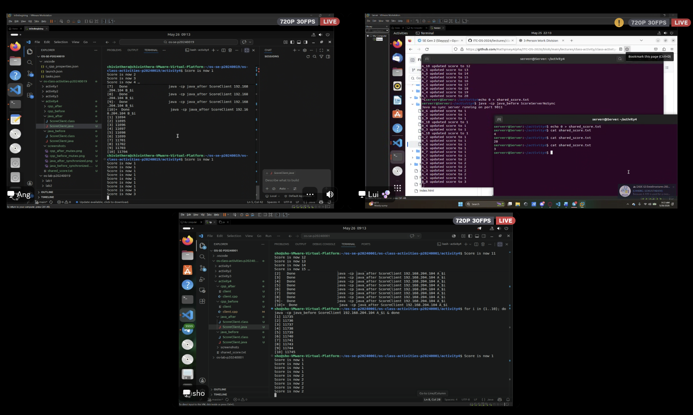

# Class Activity 4 — Shared File API
- **Student Name:** Chiv Inthera
- **Student ID:** p20240019
- **Partner Name:** Kiv SovannLyda
- **Partner Student ID:** p20240003
- **Server Machine Owner:** Hen Chhordavattry
- **Server IP Address:** 192.168.204.104

---

## Task 1: C++ Before Mutex

- **Expected score after 20 total client requests:** 20
- **Actual score:** 2
- **What happened:** Because the server handled each client in a separate thread with no synchronization, multiple threads read the same score value at the same time before any of them had a chance to write the incremented result back. This is a classic read-modify-write race condition: most of the 20 increments were lost because threads overwrote each other's updates. The final score was only 2 instead of 20, demonstrating that unprotected concurrent file access produces incorrect and unpredictable results.

---

## Task 2: C++ After Mutex

- **Expected score after 20 total client requests:** 20
- **Actual score:** 20
- **What changed after adding mutex:** Adding `std::mutex` and `std::lock_guard` forced all threads to take turns accessing the shared file. Only one thread at a time could read the score, increment it, and write it back. As a result, none of the updates were lost and the server log showed the score climbing cleanly from 1 to 20. The result was consistent and correct every time the test was repeated.

---

## Task 3: Java Before Synchronized

- **Expected score after 20 total client requests:** 20
- **Actual score:** 4
- **What happened:** The Java server spawned a new thread for each client connection but did not protect the shared file. Multiple threads interleaved their read-increment-write operations, causing most updates to overwrite each other. The final score was only 4 — far below the expected 20 — confirming that Java threads suffer from the same race condition as C++ threads when no synchronization is applied.

---

## Task 4: Java After Synchronized

- **Expected score after 20 total client requests:** 20
- **Actual score:** 20
- **What changed after adding synchronized:** Marking the score-update method with the `synchronized` keyword made the JVM allow only one thread at a time to execute that critical section. Each thread had to wait for the previous one to finish reading, incrementing, and writing before it could begin. The server log showed the score incrementing one step at a time up to 20, and the result was consistent across repeated runs.

---

## Questions

**1. Why should clients send requests to the server instead of writing the file directly?**

If clients wrote to the file directly over the network, there would be no central point to control access. Any two clients could open the file simultaneously and corrupt each other's writes. By routing all updates through a single server process, we create one gatekeeper that can apply synchronization (mutex or synchronized) to enforce orderly, one-at-a-time access to the shared resource.

**2. Why does the server still have a race condition before mutex or synchronized?**

Even though there is only one server process, it spawns a separate thread for every client connection. Threads inside the same process share memory and file handles, so when two threads both execute the read-increment-write sequence at the same time, they can each read the same "old" value, both compute `old + 1`, and both write back the same result — effectively losing one increment. The race condition exists at the thread level, not the process level.

**3. In the C++ fixed version, what does `std::lock_guard<std::mutex>` protect?**

It protects the entire critical section that handles the shared score file: reading the current value from `shared_score.txt`, adding 1 to it, and writing the new value back. The `lock_guard` acquires the mutex when it is constructed and automatically releases it when it goes out of scope, ensuring no other thread can enter that same block while the first thread is still working on it.

**4. In the Java fixed version, what does `synchronized` protect?**

The `synchronized` keyword on the score-update method protects the same read-modify-write sequence on the shared file. Java's built-in monitor lock on the object means only one thread may execute that method at a time. Any other thread that tries to call it while the lock is held is blocked until the current thread exits the method and releases the lock.

**5. Why is the final score expected to be 20 when Student A sends 10 requests and Student B sends 10 requests?**

Each request represents exactly one score increment. Student A contributes 10 increments and Student B contributes 10 increments, for a total of 20 individual +1 operations. If all 20 operations are applied correctly without any being lost to a race condition, the score must end at 20.

**6. What could happen if two separate servers update the same file at the same time?**

A mutex or `synchronized` keyword only prevents race conditions among threads within the same process. If two separate server processes both read and write the same file on disk, the OS provides no automatic mutual exclusion between them. Both servers could read the same score, each increment it independently, and then overwrite each other's result — producing an incorrect final value. Fixing this would require a file-level lock (such as `flock` on Linux or a lock file) or a shared database that supports atomic transactions.

---

## Reflection

This activity clearly illustrated the difference between expected behavior and actual behavior when shared resources are not protected. In both C++ and Java, the unprotected servers produced wildly wrong scores — 2 and 4 respectively instead of 20 — because threads were silently overwriting each other's work with no errors or warnings from the system. The fix in each language was conceptually identical: allow only one thread at a time to perform the read-increment-write sequence. C++ achieves this with `std::mutex` and `std::lock_guard`, which uses RAII to guarantee the lock is always released even if an exception occurs. Java achieves it with the `synchronized` keyword, which ties the lock to the object's built-in monitor and handles release automatically when the method returns. Both approaches define a critical section and serialize access to it. The key lesson is that correctness in concurrent programs cannot be assumed — any shared state that multiple threads touch must be explicitly protected, and the protection must cover the entire sequence of operations that must appear atomic, not just individual reads or writes in isolation.