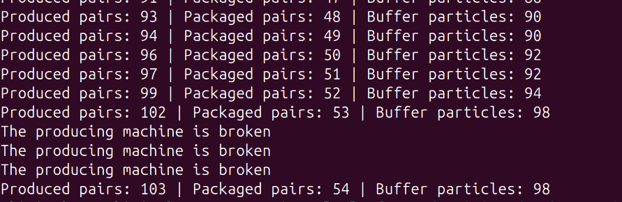
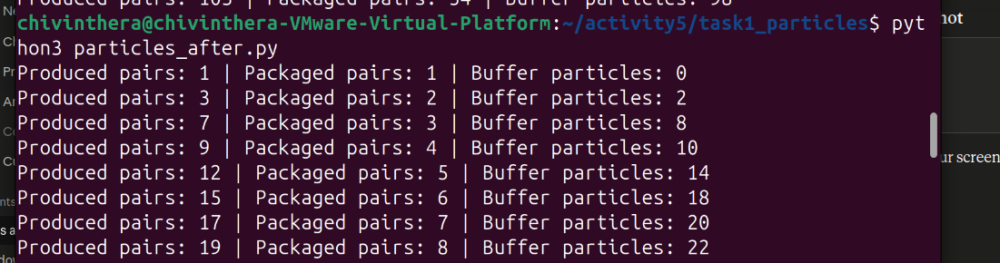
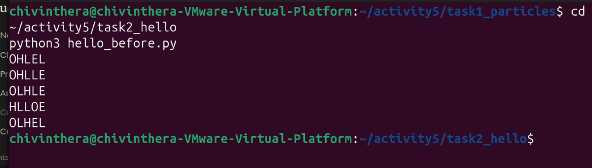
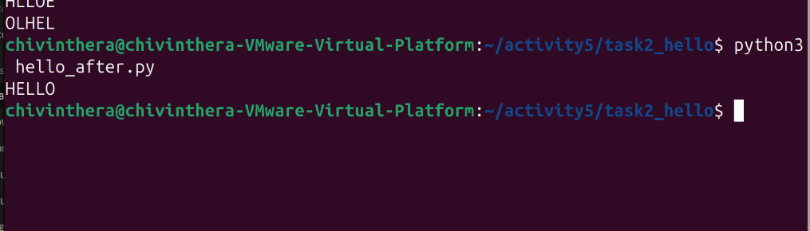

cat > ~/activity5/README.md << 'EOF'
# Class Activity 5 - Semaphores

- **Student Name:** Chiv Inthera
- **Student ID:** p20240019
- **Programming Language Used:** Python

---

## Task 1A: Particle Pair Buffer Before Semaphores

- What error or incorrect behavior appeared: The packaging machine is broken / Pairs are incorrect
- Why did this happen without semaphore protection: Multiple threads access the buffer at the same time with no coordination, causing race conditions and empty buffer reads or mismatched pairs.

---

## Task 1B: Particle Pair Buffer After Semaphores

- Number of producer machines: 3
- Buffer capacity: 100 particles (50 pairs)
- Semaphores used: empty_pairs, full_pairs, mutex
- Produced pair count shown in screenshot: (fill in from your screenshot)
- Packaged pair count shown in screenshot: (fill in from your screenshot)
- Did any error appear during normal operation? No

---

## Task 2A: HELLO Before Semaphores

- Output before semaphore ordering: Letters print in wrong or unpredictable order
- Why this output can be wrong or unpredictable: Threads run concurrently with no ordering constraints so any thread can print at any time

---

## Task 2B: HELLO After Semaphores

- Processes or threads used: 3 threads
- Semaphores used: start_h, after_e, after_l1, after_l2
- Final output: HELLO

---

## Questions

1. A producer must wait because the buffer may be full. Adding without waiting would overflow the buffer past 100 particles.
2. The consumer must wait because the buffer may be empty. Removing without waiting would cause an underflow and broken pair reads.
3. The mutex semaphore protects the critical section where the buffer is read or written.
4. Each particle is named with its machine ID and pair number (e.g. M2-17-P1). After removing two particles, the program strips the P1/P2 suffix and checks that both prefixes match.
5. Without semaphores, all three threads start at the same time with no ordering. Whichever thread gets CPU time first prints first.
6. The start_h semaphore initialised to 1 ensures Process 1 runs first and prints H before any other letter can be printed.
7. Deadlock could happen if two threads each hold one semaphore and wait for the other, or if a signal is never called after an acquire, leaving other threads waiting forever.

---

## Reflection

These simulations showed that semaphores solve two different problems. Counting semaphores track how many resources are available so producers and consumers never over-produce or under-consume. Mutex semaphores protect shared data from simultaneous access. For ordering problems like HELLO, semaphores act as gates that force threads to wait until the previous step is done before proceeding.
EOF