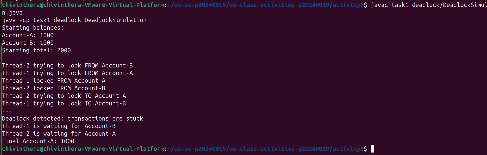
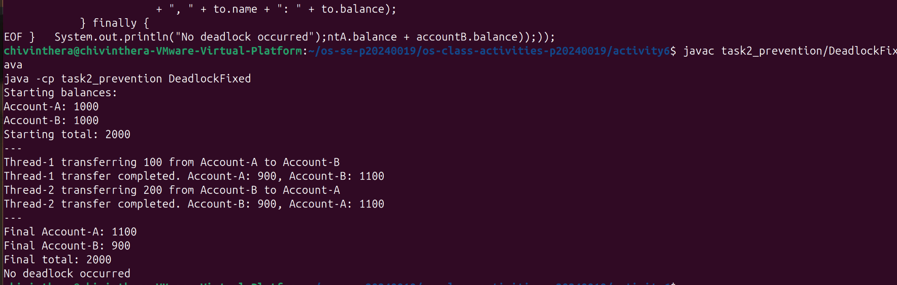

# Class Activity 6 - Deadlock Simulation

- **Student Name:** Chiv Inthera
- **Student ID:** p20240019
- **Programming Language Used:** Java

---

## Task 1: Deadlock Version

- Shared resources: Account-A and Account-B
- Transaction 1: Transfer 100 from Account-A to Account-B
- Transaction 2: Transfer 200 from Account-B to Account-A
- Deadlock message shown: `Deadlock detected: transactions are stuck`
- Explanation of why the program got stuck: Thread-1 locked Account-A and waited for Account-B, while Thread-2 locked Account-B and waited for Account-A. Neither thread could continue because each was waiting for the other to release its lock, causing a circular wait.

---

## Task 2: Deadlock Prevention Version

- Prevention strategy used: Single semaphore mutex initialized to 1
- Semaphore mutex initial value: 1
- Starting total: 2000
- Final total: 2000
- Did both transfers complete? Yes
- Why no deadlock occurred: Only one thread can acquire the mutex at a time. This means only one transfer runs at a time, so there is no circular wait between account locks.

---

## Questions

1. **What are the two shared resources in your bank transaction simulation?**
   > Account-A and Account-B are the two shared resources. Both threads need access to both accounts to complete their transfers.

2. **Which line or section of your Task 1 program creates hold-and-wait?**
   > The hold-and-wait happens when a thread acquires `from.lock` and then tries to acquire `to.lock` while still holding the first lock. The thread holds one lock and waits for the other.

3. **How does Task 1 create circular wait?**
   > Thread-1 holds Account-A and waits for Account-B. At the same time, Thread-2 holds Account-B and waits for Account-A. Each thread is waiting for the other to release, creating a circle.

4. **Why does the Task 1 program need a watchdog or timeout?**
   > Without a watchdog the program would hang forever silently. The watchdog checks after 3 seconds if the threads are still alive and prints the deadlock message so we can see what happened.

5. **How does the single semaphore mutex prevent deadlock in Task 2?**
   > The mutex allows only one thread to enter the transfer operation at a time. Since only one transfer runs at a time, no two threads can hold different locks and wait for each other, so circular wait is impossible.

6. **Which of the four deadlock conditions does your Task 2 solution remove or avoid?**
   > It removes circular wait and hold-and-wait. Since only one thread can hold the mutex at a time, no thread can hold one account lock while waiting for another.

7. **Why must the final total bank balance remain unchanged after both transfers?**
   > Money is only moved between accounts, not created or destroyed. Transfer 1 moves 100 from A to B, and Transfer 2 moves 200 from B to A. The total must stay at 2000 to prove no money was lost or duplicated.

---

## Reflection

> This activity taught me that deadlock happens when two threads each hold a resource the other needs. In real systems like banking or databases, this can cause the whole system to freeze. Using a single semaphore mutex is a simple and reliable way to prevent deadlock by making sure only one transaction runs at a time. In production systems, careful lock ordering and timeouts are also used to avoid and recover from deadlocks.