# Class Activity 7 - Reasoning About Deadlock

- **Student Name:** Chiv Inthera
- **Student ID:** p20240029
- **My personalization:** a = 9, b = 2

---

## Task 1 — Resource Allocation Graphs

### Part A

**Graph 1 — my prediction:**
There is a cycle: P0 → R1 → P1 → R2 → P2 → R0 → P0
Every process is waiting for a resource held by another. DEADLOCKED.

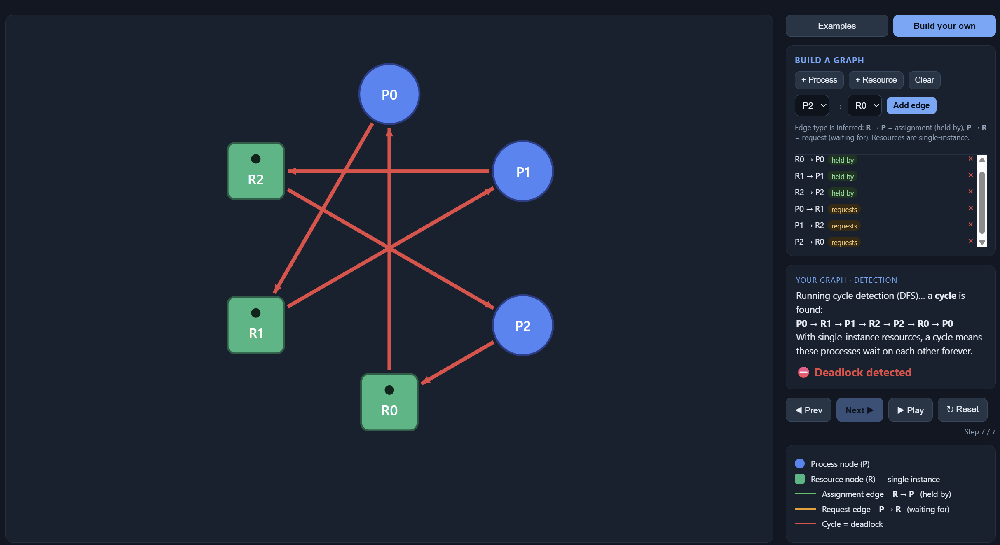
Matched the tool? Yes

**Graph 2 — my prediction:**
No cycle. P2 holds R2 and wants nothing so P2 finishes first.
Then P1 gets R2 and finishes. Then P0 finishes. NOT deadlocked.

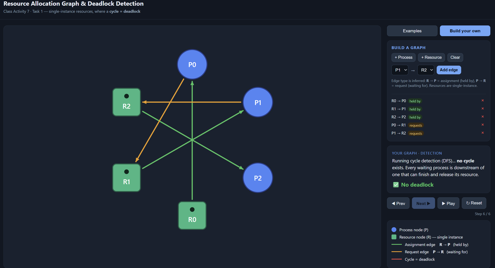
Matched the tool? Yes

### Part B

**(i) Deadlocked 3×3 graph**
Edges: R0→P0, R1→P1, R2→P2, P0→R1, P1→R2, P2→R0
Each process holds one resource and waits for the next in a circle so nobody can ever finish.

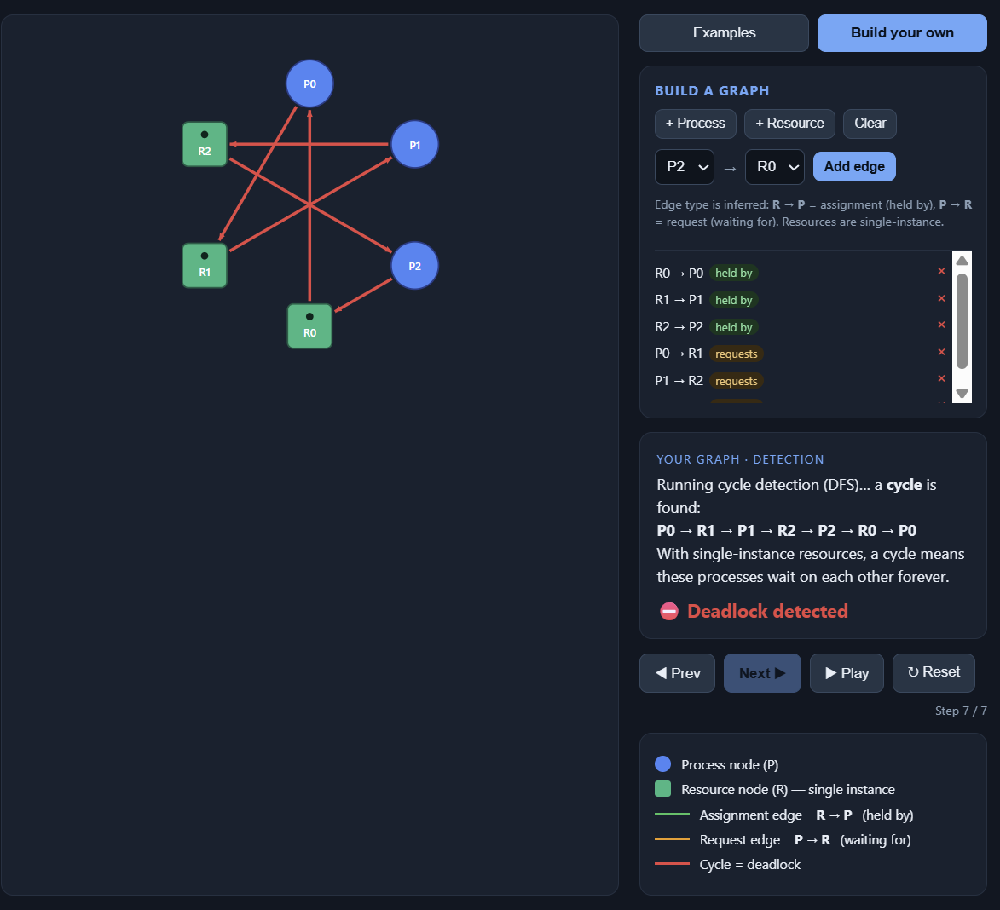

**(ii) No-cycle graph (4 nodes, 1 request)**
Edges: R0→P0, R1→P1, P0→R1
P1 holds R1 and wants nothing so P1 finishes first and releases R1 for P0. No circular wait.

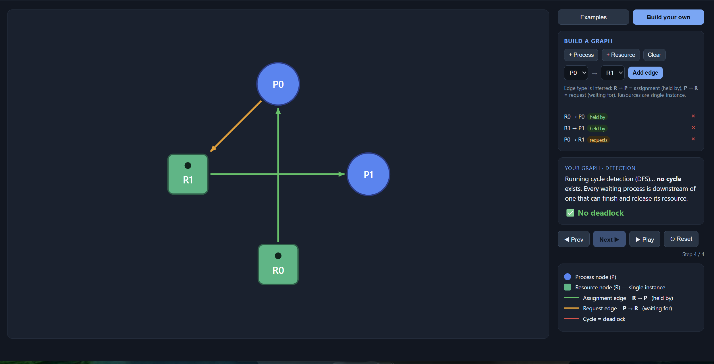

---

## Task 2 — Cycle ≠ Deadlock

**Warm-up (built-in examples)**

1. P3 requests nothing so it can finish immediately and return its resource. That spare instance breaks the cycle so no deadlock.

2. Removing the spare instance so every resource instance is held by a waiting process. Nobody can start so deadlock happens.

**Part A — given scenario**

Available = [2,1,2] − [2,1,2] = [0, 0, 0]

Cycle: P1 → R2 → P2 → R1 → P1
P3 is not in the cycle and requests [0,0,0] so P3 finishes first.

| Step | Process | Why Request ≤ Work | Work after release |
|------|---------|--------------------|--------------------|
| 1 | P3 | [0,0,0] ≤ [0,0,0] ✓ | [1, 0, 1] |
| 2 | P2 | [1,0,0] ≤ [1,0,1] ✓ | [1, 1, 2] |
| 3 | P1 | [0,1,0] ≤ [1,1,2] ✓ | [2, 1, 2] |

Conclusion: NOT deadlocked — finishing order = P3 → P2 → P1

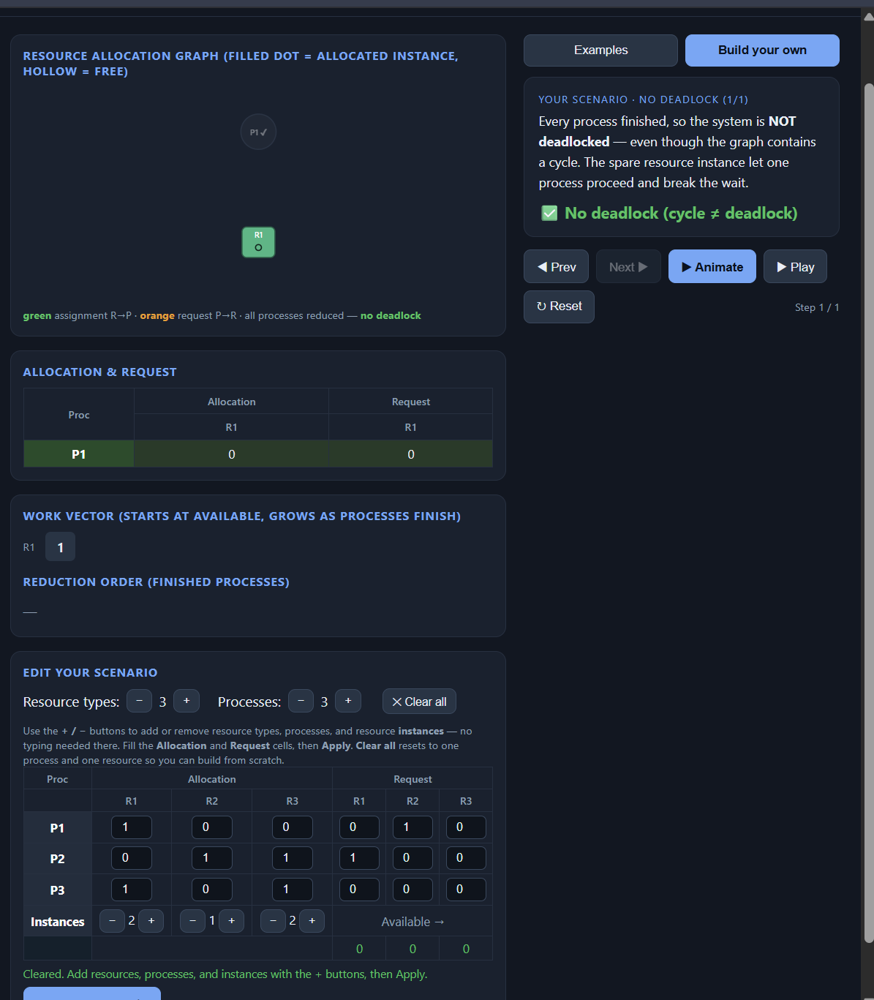

After changing P3 request to 0 1 0:
Now P3 needs R2=1 but Work R2=0 so P3 cannot start. P1 and P2 also cannot start. Nobody can go first. DEADLOCKED.

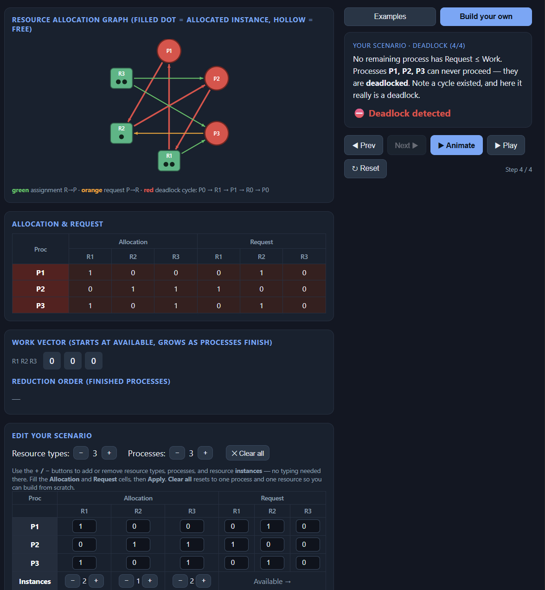

**Part B — my own scenario**

2 processes, 2 resources. R1=2 instances, R2=1 instance.
P1 holds R1 requests R2. P2 holds R2 requests R1.
Cycle exists but spare R1 instance lets P2 finish first. NOT deadlocked.

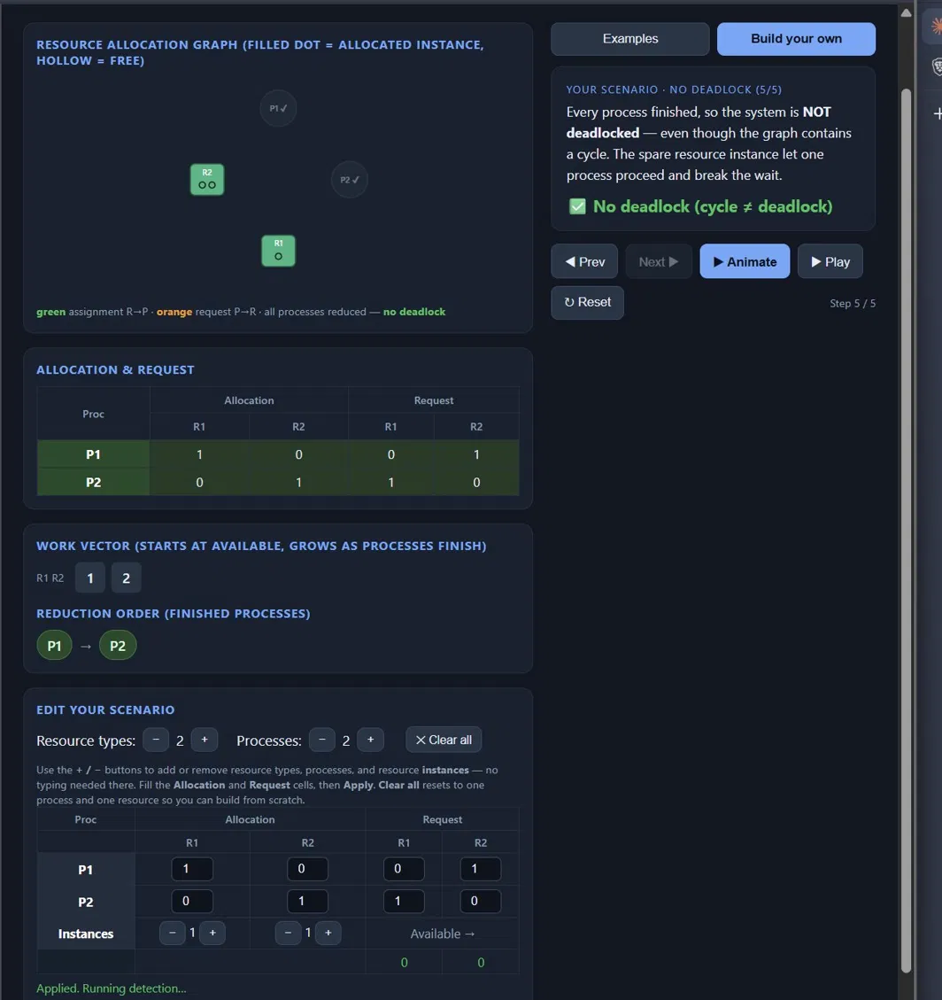

Changed R1 instances from 2 to 1. Now Available=[0,0] and nobody can satisfy Request ≤ Work. DEADLOCKED.

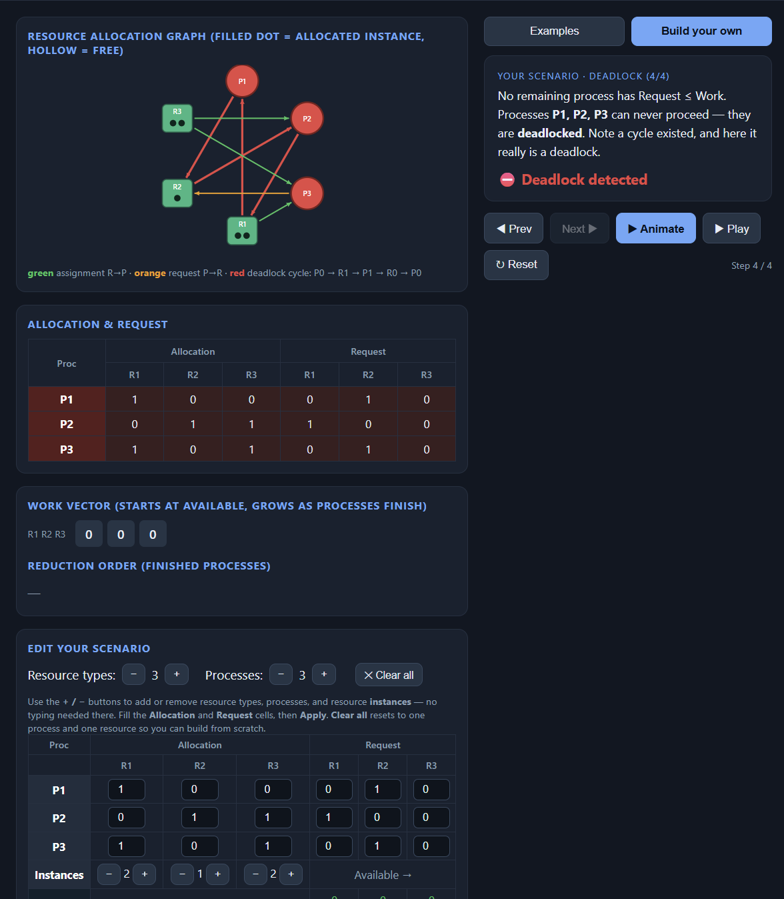

---

## Task 3 — Banker's Algorithm

- Max[P0][A] = 7 + (9 mod 3) = 7
- Max[P2][C] = 2 + (2 mod 4) = 4

**Need matrix:**
**Available:** [10,5,7] − [5,1,2] = [5, 4, 5]

**Safety trace:**

| Step | Process | Why Need ≤ Work | Work after release |
|------|---------|-----------------|--------------------|
| 1 | P1 | [1,2,2] ≤ [5,4,5] ✓ | [7, 4, 5] |
| 2 | P0 | [7,4,3] ≤ [7,4,5] ✓ | [7, 5, 5] |
| 3 | P2 | [6,0,2] ≤ [7,5,5] ✓ | [10, 5, 7] |

Conclusion: SAFE — safe sequence = P1 → P0 → P2

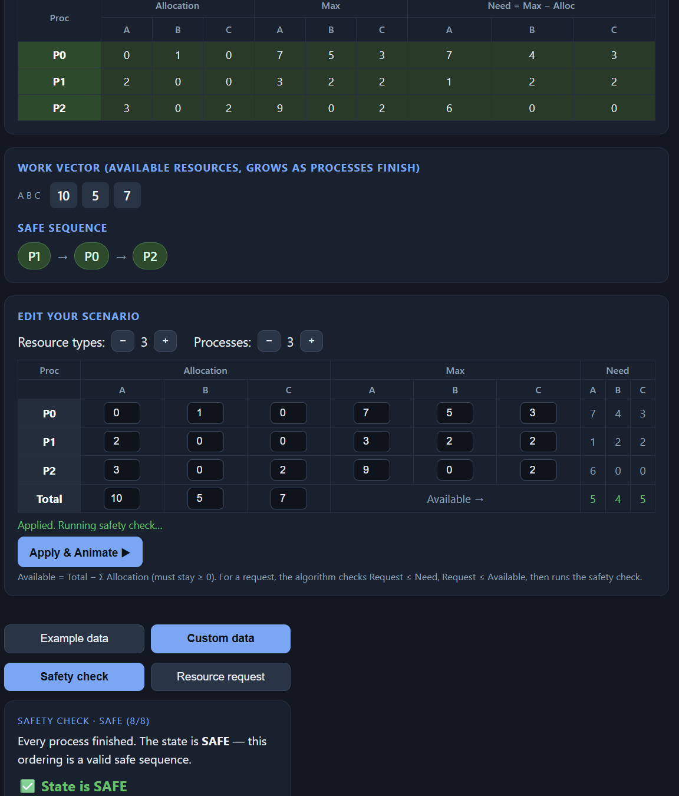
Matched the tool? Yes

**Request I predicted GRANTED:** P1 requests [1,0,0]
- Check 1: [1,0,0] ≤ Need[1,2,2] ✓
- Check 2: [1,0,0] ≤ Available[5,4,5] ✓
- Check 3: Still safe after granting ✓
- GRANTED

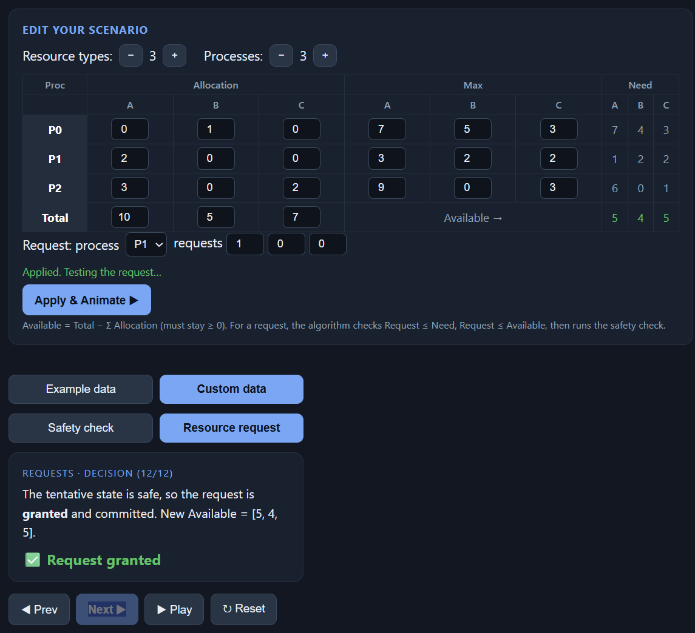

**Request I predicted DENIED:** P2 requests [7,0,0]
- Check 1: 7 ≤ Need[P2][A]=6? FAIL
- DENIED — request exceeds maximum need

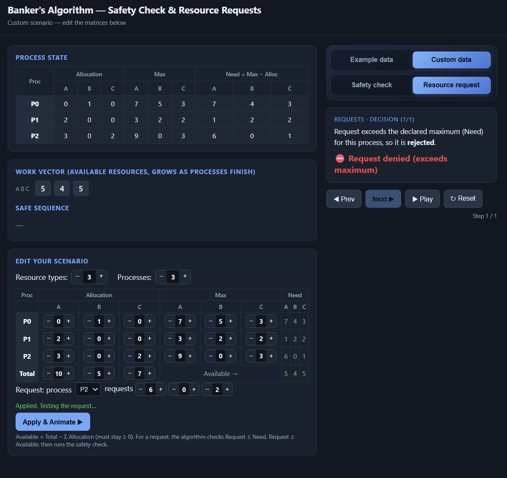

---

## Task 4 — Semaphores and Deadlock

**Case 1 — NO**
All processes acquire semaphores in ascending order s1→s2→s3.
No circular wait can form so no deadlock.

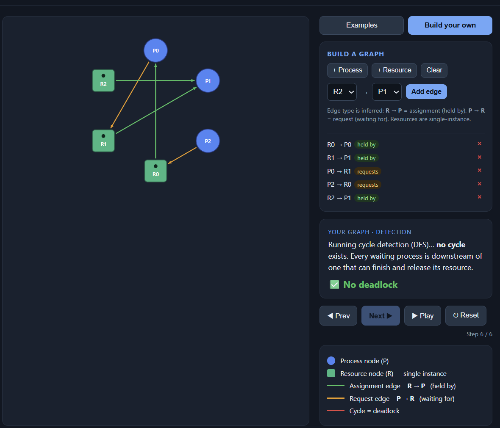
Tool confirmed? Yes — no deadlock.

**Case 2 — YES**
P3 changed order to s2→s3→s1 which breaks the ascending rule.
P1 holds s1 and waits for s2. P3 holds s2 and waits for s1.
Cycle: P1 → s2 → P3 → s1 → P1. DEADLOCK.

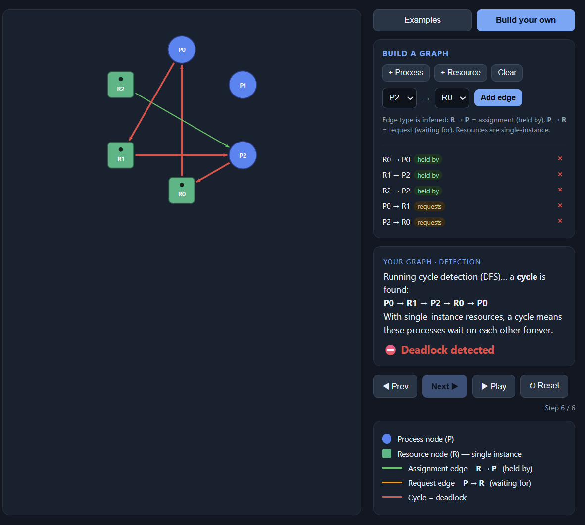
Tool confirmed? Yes — deadlock detected.

**Case 3 — NO**
Same as Case 2 but s1 has 2 instances.
When P3 does wait(s1), one instance is still free so P3 never blocks.
P3 finishes and releases everything. The extra s1 instance breaks the deadlock.

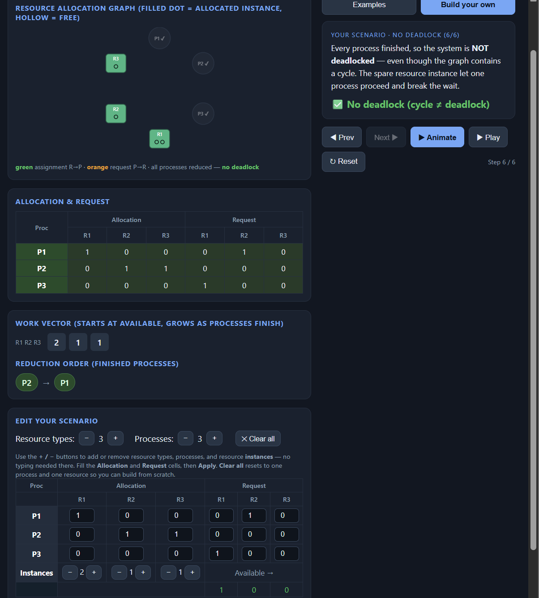
Tool confirmed? Yes — no deadlock.

---

## Task 5 — Applied Concepts

1. Four conditions using two chefs sharing one knife and one cutting board:
   - Mutual exclusion: only one chef uses the knife at a time
   - Hold and wait: Chef A holds knife while waiting for the board
   - No preemption: you cannot take the knife from a chef mid-cut
   - Circular wait: Chef A waits for board held by Chef B, Chef B waits for knife held by Chef A
   Easiest to remove: Hold and Wait — put down knife before picking up board. Cost: less efficient.

2. In single-instance systems a cycle means deadlock because every process is stuck waiting. In multi-instance systems a spare instance can let one process finish and break the cycle so a cycle alone does not guarantee deadlock.

3. Unsafe means deadlock might happen in the future but nobody is stuck yet. Deadlocked means processes are already permanently stuck. Example: Available=[0,0,0] but one process needs nothing — not deadlocked yet but unsafe.

4. Banker's cost: processes must declare max needs upfront and some safe requests get denied. Good for real-time systems. Detection and recovery cost: deadlock actually happens before it is caught and recovery loses work. Good for general-purpose systems and databases.

5. Banker's needs max demand upfront to simulate worst-case future and check safety. Problem: most processes do not know their max needs in advance so they overestimate which wastes resources.

---

## Reflection

This activity taught me that a cycle only means deadlock when every resource has one instance. With multiple instances a spare unit can let one process finish and break the cycle. Banker's Algorithm prevents deadlock by checking safety before every request but requires processes to declare their maximum needs upfront which is hard in practice. Detection and recovery is more flexible but deadlock must actually happen before it gets fixed. Real systems like databases prefer detection because resource needs are hard to predict in advance.