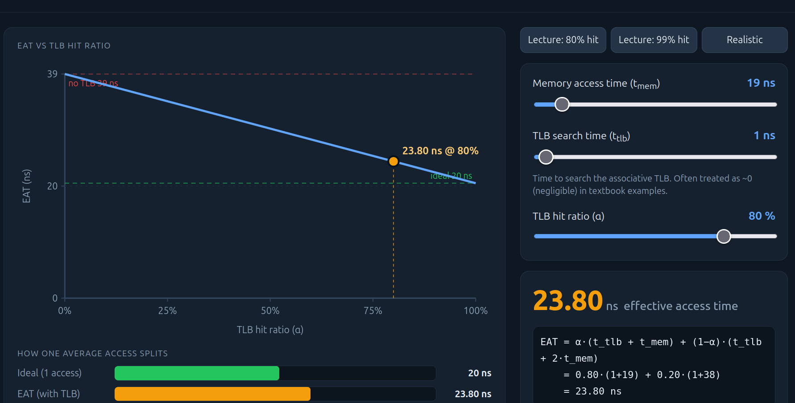
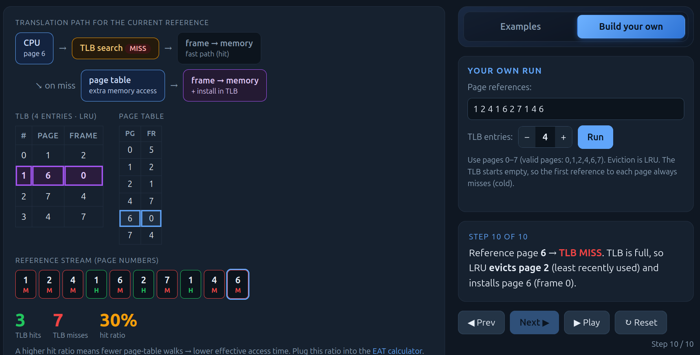
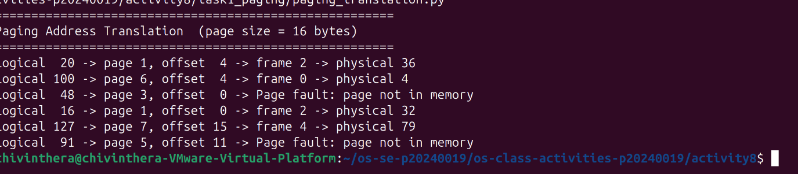
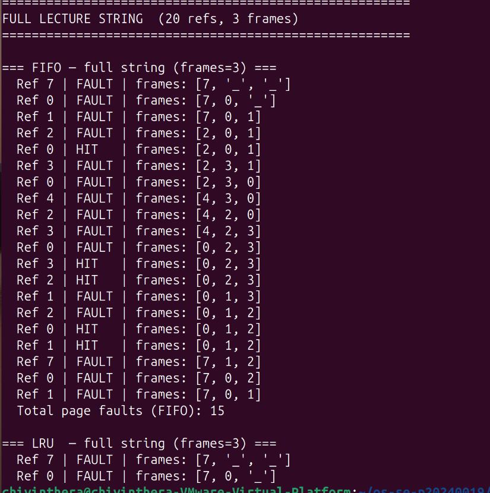
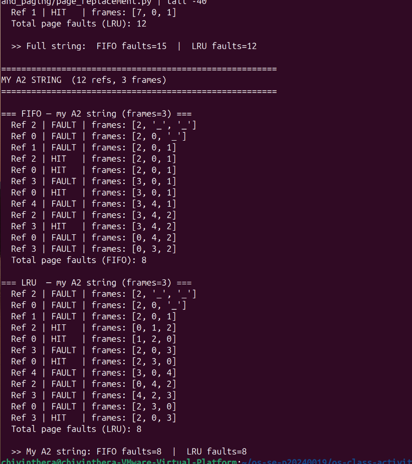

# Class Activity 8 - Memory Management & Virtual Memory
# Class Activity 8 - Memory Management & Virtual Memory

- **Student Name:** ChivInthera   **Student ID:** p20240019
- **Personalization:** a = 9, b = 1 → N = (10×9+1) mod 128 = 91
- **Programming Language Used:** Python

## Part 1A — Address translation (by hand)

| LA  | page = LA÷16 | offset = LA mod 16 | valid? | frame | physical = frame×16+offset |
|-----|-------------|-------------------|--------|-------|---------------------------|
| 20  | 1           | 4                 | YES    | 2     | 2×16+4 = 36               |
| 100 | 6           | 4                 | YES    | 0     | 0×16+4 = 4                |
| 48  | 3           | 0                 | NO     | —     | Page fault                |
| 16  | 1           | 0                 | YES    | 2     | 2×16+0 = 32               |
| 127 | 7           | 15                | YES    | 4     | 4×16+15 = 79              |
| 91  | 5           | 11                | NO     | —     | Page fault                |

1. The offset is the position within the page — it stays the same when the page moves to a different frame.
2. Largest offset = 15 (values 0–15), needs 4 bits (2⁴ = 16).
3. 60 + 9 = 69 bytes → ceil(69÷16) = 5 pages → last page uses 5 bytes → internal fragmentation = 16 - 5 = 11 bytes wasted.

## Part 1B — TLB & Effective Access Time (by hand)

My page-reference stream: 1 2 4 1 6 2 7 1 4 6  (a=9, a mod 8 = 1, first page stays 1)
Prediction: I expect about 3 hits — pages 1, 2, 6 repeat but the TLB only holds 4 entries so later misses will evict earlier ones.

| Ref (page) | HIT/MISS | Page table read? | TLB after (LRU→MRU) | Evicted |
|------------|----------|-----------------|---------------------|---------|
| 1          | MISS     | Yes             | [1]                 | —       |
| 2          | MISS     | Yes             | [1,2]               | —       |
| 4          | MISS     | Yes             | [1,2,4]             | —       |
| 1          | HIT      | No              | [2,4,1]             | —       |
| 6          | MISS     | Yes             | [2,4,1,6]           | —       |
| 2          | HIT      | No              | [4,1,6,2]           | —       |
| 7          | MISS     | Yes             | [1,6,2,7]           | 4       |
| 1          | HIT      | No              | [6,2,7,1]           | —       |
| 4          | MISS     | Yes             | [2,7,1,4]           | 6       |
| 6          | MISS     | Yes             | [7,1,4,6]           | 2       |

Measured hits: 3/10 → hit ratio α = 0.30

**EAT calculation** (t_mem = 10+9 = 19 ns, t_tlb = 1 ns):

EAT formula: α·(t_tlb + t_mem) + (1−α)·(t_tlb + 2·t_mem)

- EAT at α=0.30: 0.30×(1+19) + 0.70×(1+38) = 0.30×20 + 0.70×39 = 6 + 27.3 = **33.3 ns**
- EAT at α=0.80: 0.80×20 + 0.20×39 = 16 + 7.8 = **23.8 ns**
- EAT at α=0.99: 0.99×20 + 0.01×39 = 19.8 + 0.39 = **20.19 ns**
- No TLB:        1 + 2×19 = **39 ns**

99% is (39 - 20.19)/39 × 100 ≈ **48% faster** than no TLB.

## Part 1C — Paging simulator verification

- Did the simulator match my 1A table? Yes — all 6 addresses matched, including both PAGE FAULTs for pages 3 (LA=48) and 5 (LA=91).

## Part 2A — Page replacement (by hand)

My reference string: 2 0 1 2 0 3 0 4 2 3 0 3  (a mod 7 = 2, replaces first 7)
Frames: 3, start empty
Prediction: I predicted FIFO would fault more because it may evict pages needed soon, while LRU keeps recently used pages.

### FIFO trace
| Ref | H/F | F1 | F2 | F3 | Evicted |
|-----|-----|----|----|----|---------|
| 2   | F   | 2  | _  | _  | —       |
| 0   | F   | 2  | 0  | _  | —       |
| 1   | F   | 2  | 0  | 1  | —       |
| 2   | H   | 2  | 0  | 1  | —       |
| 0   | H   | 2  | 0  | 1  | —       |
| 3   | F   | 3  | 0  | 1  | 2       |
| 0   | H   | 3  | 0  | 1  | —       |
| 4   | F   | 3  | 4  | 1  | 0       |
| 2   | F   | 3  | 4  | 2  | 1       |
| 3   | H   | 3  | 4  | 2  | —       |
| 0   | F   | 0  | 4  | 2  | 3       |
| 3   | F   | 0  | 3  | 2  | 4       |

Total FIFO faults: 8

### LRU trace
| Ref | H/F | F1 | F2 | F3 | Evicted |
|-----|-----|----|----|----|---------|
| 2   | F   | 2  | _  | _  | —       |
| 0   | F   | 2  | 0  | _  | —       |
| 1   | F   | 2  | 0  | 1  | —       |
| 2   | H   | 2  | 0  | 1  | —       |
| 0   | H   | 2  | 0  | 1  | —       |
| 3   | F   | 2  | 0  | 3  | 1       |
| 0   | H   | 2  | 0  | 3  | —       |
| 4   | F   | 4  | 0  | 3  | 2       |
| 2   | F   | 4  | 0  | 2  | 3       |
| 3   | F   | 4  | 3  | 2  | 0       |
| 0   | F   | 0  | 3  | 2  | 4       |
| 3   | H   | 0  | 3  | 2  | —       |

Total LRU faults: 8

Both tied at 8 faults. My prediction was wrong — I expected FIFO to fault more but they tied.

## Part 2B — Demand-paging simulator verification

- Did the simulator's counts for my 2A string match my hand totals? Yes — both FIFO and LRU reported 8 faults, matching the hand traces exactly.

## Part 3 — Applied reasoning

1. Paging uses fixed-size frames so any free frame fits any page — no gaps left between allocations. Contiguous allocation leaves holes between blocks that may be too small to reuse.

2. The page is still not in memory — the OS must still handle the interrupt and load it from disk, whether the frame is empty or not.

3. At α=0.99 EAT = 20.19 ns vs no TLB = 39 ns — nearly 48% faster. At α=0.80 EAT = 23.8 ns, which is only 39% faster. That last 19% hit ratio saves 3.6 ns per access, which adds up enormously over millions of accesses per second.

4. They diverged at ref 7 (page 3): FIFO evicted page 2 (oldest loaded), LRU evicted page 1 (least recently used). Both choices led to the same total faults so they tied at 8.

5. Thrashing is when a process spends more time handling page faults than running. With 1 frame in Part 2B, every reference faults — 20 faults total. The TLB hit ratio also collapses to near 0 because pages are evicted before they can be reused.

6. Benefit: faster startup since only needed pages load first. Risk: a burst of faults early on can make the program feel slow to the user.
