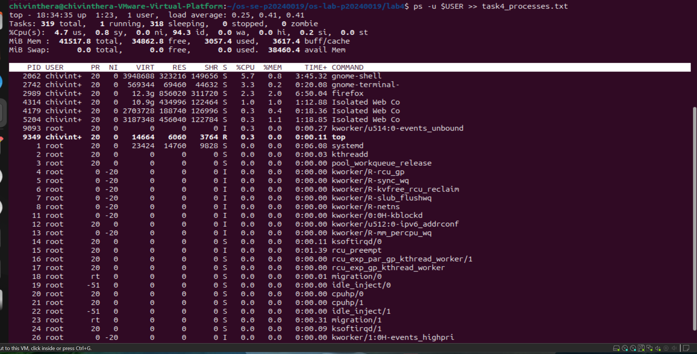
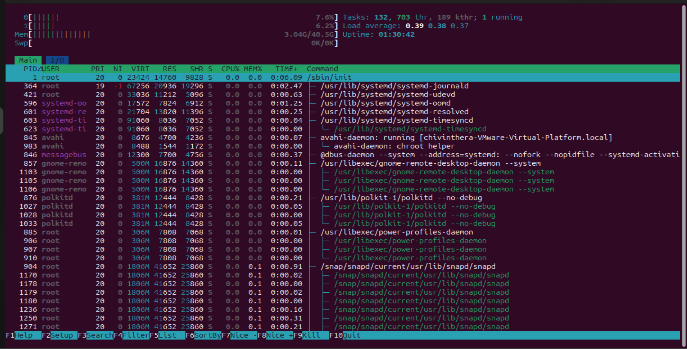
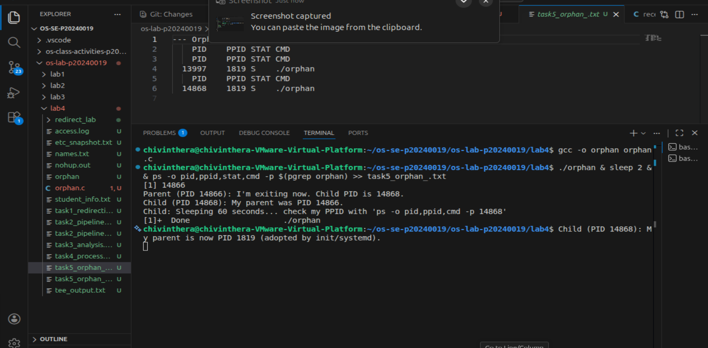
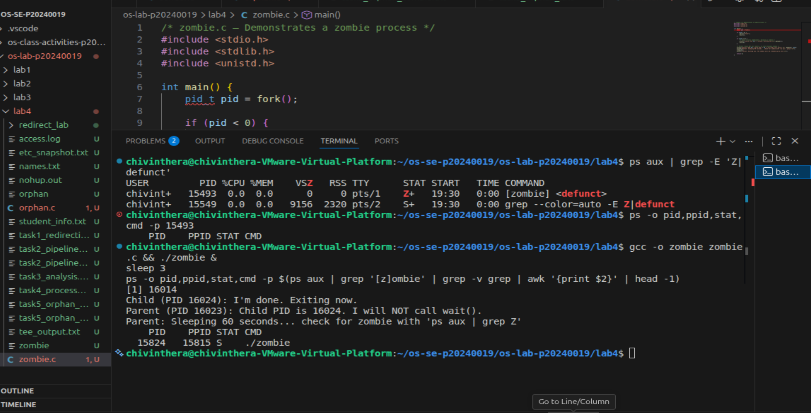
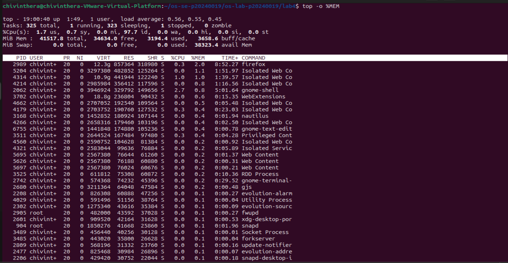
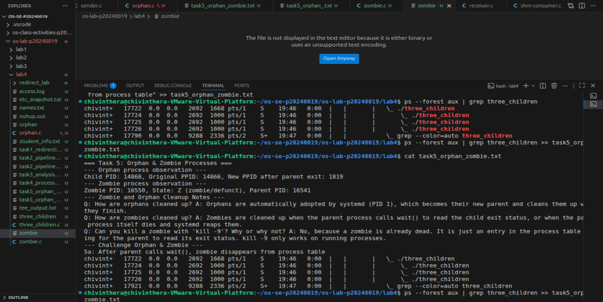
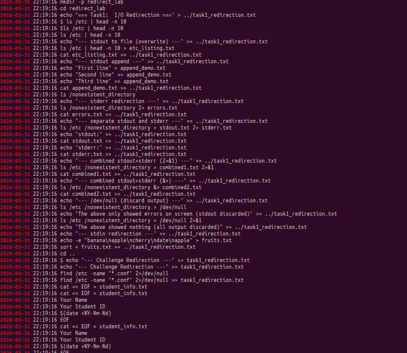

# OS Lab 4 Submission — I/O Redirection, Pipelines & Process Management

- **Student Name:** [Your Name Here]
- **Student ID:** [Your Student ID Here]

---

## Task Output Files

During the lab, each task redirected its output into `.txt` files. These files are your primary proof of work for the **guided portions** of each task. Make sure all of the following files are present in your `lab4/` folder:

- [ ] `task1_redirection.txt`
- [ ] `task2_pipelines.txt`
- [ ] `task3_analysis.txt`
- [ ] `task4_processes.txt`
- [ ] `task5_orphan_zombie.txt`
- [ ] `orphan.c`
- [ ] `zombie.c`
- [ ] `access.log`

---

## Screenshots

The screenshots below document the **interactive tools**, **process observations**, **challenge sections**, and **command history**.

---

### Screenshot 1 — Task 4: `top` Output

Show `top` running with the process list and column headers visible (PID, USER, %CPU, %MEM, COMMAND).

<!-- Insert your screenshot below: -->

---

### Screenshot 2 — Task 4: `htop` Tree View

Show `htop` in tree view (F5) displaying the process hierarchy with colored CPU/memory bars.

<!-- Insert your screenshot below: -->

---

### Screenshot 3 — Task 5: Orphan Process

Show the `ps` output proving the child process's PPID changed to 1 (or systemd PID) after the parent exited.

<!-- Insert your screenshot below: -->

---

### Screenshot 4 — Task 5: Zombie Process

Show the `ps` output with the zombie process visible — state `Z` or labeled `<defunct>`.

<!-- Insert your screenshot below: -->

---

### Screenshot 5 — Task 4 Challenge: Highest Memory Process

Show `top` sorted by memory usage with the top process identified.

<!-- Insert your screenshot below: -->

---

### Screenshot 6 — Task 5 Challenge: Process Tree with 3 Children

Show `ps --forest` output with the parent and 3 child processes visible.

<!-- Insert your screenshot below: -->

---

### Screenshot 7 — Command History

After finishing all tasks, run `history | tail -n 100` and take a screenshot.

<!-- Insert your screenshot below: -->

---

## Answers to Task 5 Questions

1. **How are orphans cleaned up?**
   > Orphan processes are not killed. When a parent process exits, the orphan is automatically adopted by the system’s init process (PID 1), typically init or systemd. The new parent then continues managing the process until it finishes execution.

2. **How are zombies cleaned up?**
   > Zombie processes are cleaned up when the parent process calls wait() (or a similar system call) to read the child’s exit status. This removes the zombie entry from the process table.If the parent does not do this, the zombie remains until the parent terminates, after which init/systemd adopts and cleans it up.

3. **Can you kill a zombie with `kill -9`? Why or why not?**
   > No, you cannot kill a zombie with kill -9. A zombie process is already dead—it has finished execution but still has an entry in the process table. Since it is not running, signals like kill -9 have no effect. The only way to remove it is for the parent to call wait() or for the parent process to terminate.

---

## Reflection

> The most useful technique I learned was using ps to view processes and identify their relationships. Pipelines and redirection are useful for filtering outputs and saving logs, which helps with monitoring and debugging on a server.