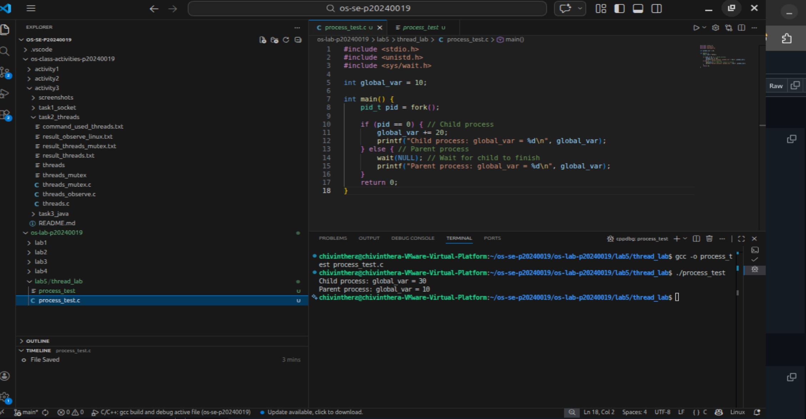
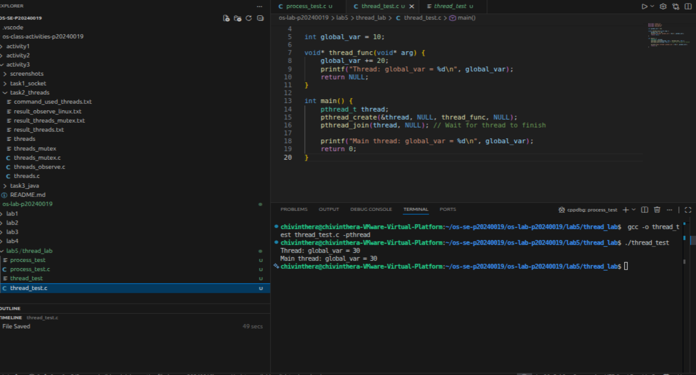
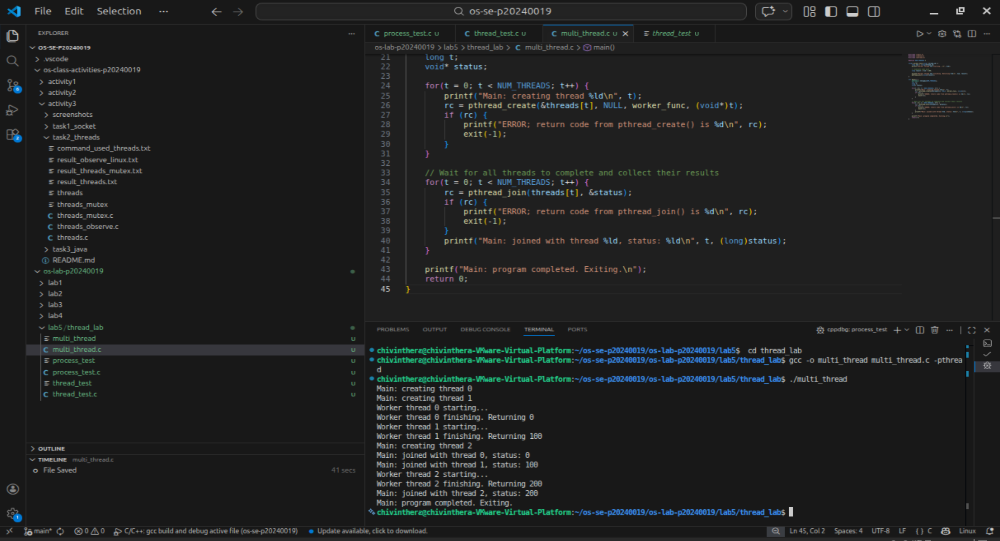
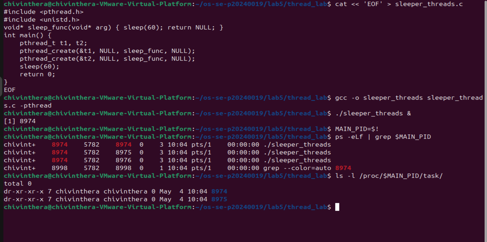
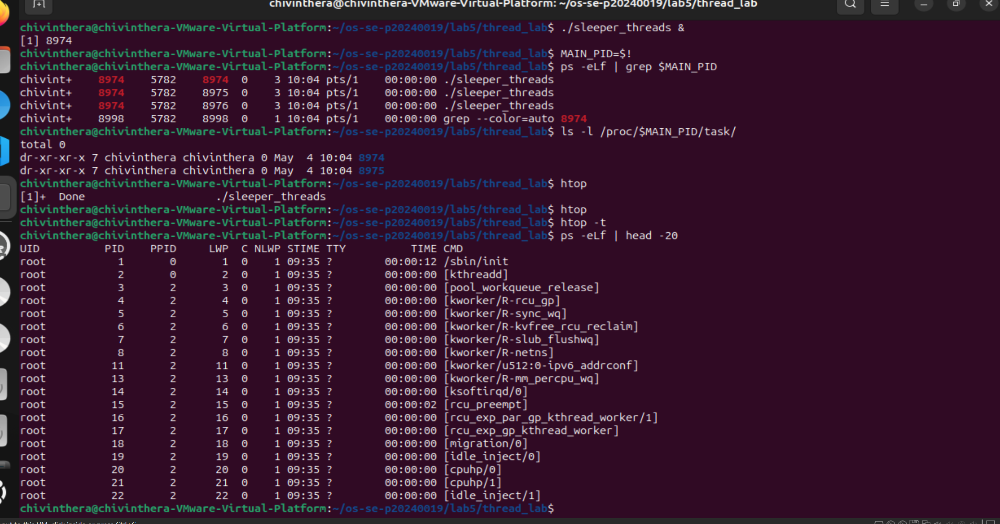
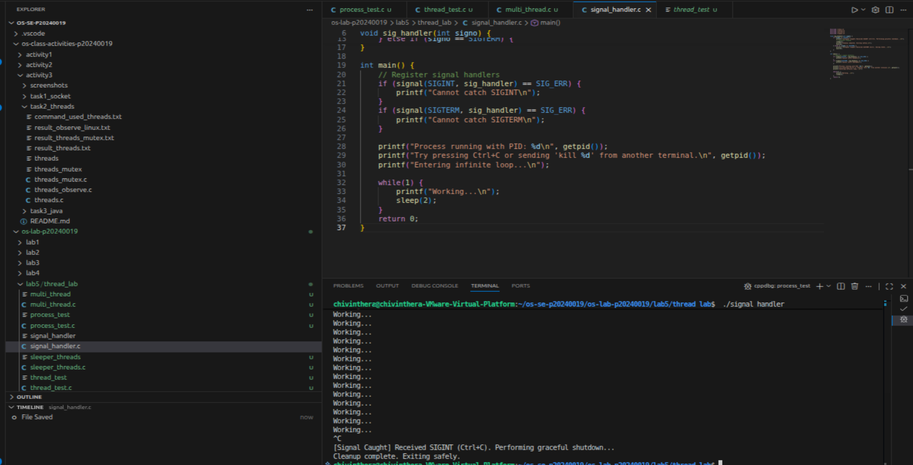
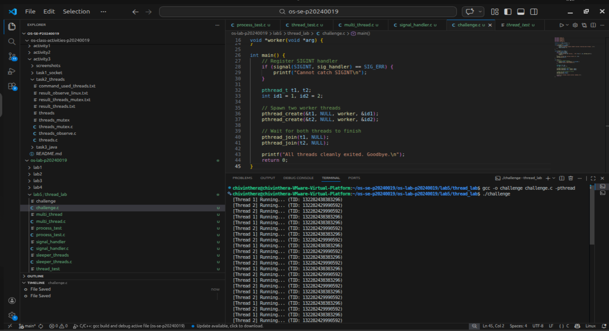

# OS Lab 5 Submission — Threads, Kernel Workers & Process Signals

- **Student Name:** [Your Name Here]
- **Student ID:** [Your Student ID Here]

---

## Task Output Source Files

Make sure all of the following files are present in your `lab5/thread_lab/` folder:

- [ ] `process_test.c`
- [ ] `thread_test.c`
- [ ] `multi_thread.c`
- [ ] `sleeper_threads.c`
- [ ] `signal_handler.c`
- [ ] `challenge.c`

---

## Screenshots

Insert your screenshots below.

### Screenshot 1 — Task 1: Process vs Thread (Process Test)
Show the output of `process_test.c`.
<!-- Insert your screenshot below: -->

---

### Screenshot 2 — Task 1: Process vs Thread (Thread Test)
Show the output of `thread_test.c`.
<!-- Insert your screenshot below: -->

---

### Screenshot 3 — Task 2: Thread Interaction
Show the output of `multi_thread.c`.
<!-- Insert your screenshot below: -->

---

### Screenshot 4 — Task 3: Visualizing 1:1 Thread Mapping
Show the `ps -eLf` output or `/proc/[pid]/task/` directory visualizing the LWP mapping for user threads.
<!-- Insert your screenshot below: -->

---

### Screenshot 5 — Task 3: `htop` Kernel Threads
Show `htop` visualizing kernel threads (usually bracketed names like `[kworker]`).
<!-- Insert your screenshot below: -->

---

### Screenshot 6 — Task 4: Catching `SIGINT`
Show the output of your `signal_handler` program gracefully catching `Ctrl+C`.
<!-- Insert your screenshot below: -->

---

### Screenshot 7 — Challenge: Graceful Multithreaded Shutdown
Show the output of your `challenge.c` program joining its threads and exiting gracefully after receiving `Ctrl+C`.
<!-- Insert your screenshot below: -->

---

## Answers to Lab Questions

1. **Why do threads share memory while processes do not (by default)?**
   > Threads exist within the same process and share the same address space, while processes have separate memory spaces isolated by the OS for protection.
2. **Based on the 1:1 mapping, what is the role of an LWP (Lightweight Process) in Linux?**
   >An LWP is the kernel-level entity that represents a thread. It allows the kernel to schedule each thread independently using the 1:1 threading model.

3. **Why is it restricted to send signals to kernel threads (e.g., `kthreadd` or `kworker`)?**
   > Kernel threads run in kernel space and have no user-space signal handlers. Sending signals to them can disrupt critical kernel operations and cause system instability.

4. **Why can't `SIGKILL` (kill -9) be caught by a signal handler?**
   >SIGKILL is handled directly by the kernel and never delivered to the process. This guarantees a way to always forcefully terminate any process, even if it's misbehaving.

---

## Reflection

> Here are the answers:

1. Why do threads share memory while processes do not (by default)?
> Threads exist within the same process and share the same address space, while processes have separate memory spaces isolated by the OS for protection.

2. What is the role of an LWP (Lightweight Process) in Linux?
> An LWP is the kernel-level entity that represents a thread. It allows the kernel to schedule each thread independently using the 1:1 threading model.

3. Why is it restricted to send signals to kernel threads (e.g., kthreadd or kworker)?
> Kernel threads run in kernel space and have no user-space signal handlers. Sending signals to them can disrupt critical kernel operations and cause system instability.

4. Why can't SIGKILL (kill -9) be caught by a signal handler?
> SIGKILL is handled directly by the kernel and never delivered to the process. This guarantees a way to always forcefully terminate any process, even if it's misbehaving.

---

Reflection:
> The most challenging part was coordinating thread exit using a shared flag with signal handlers. These concepts are essential in web servers and databases, where graceful shutdown ensures no data is lost when the process is stopped.