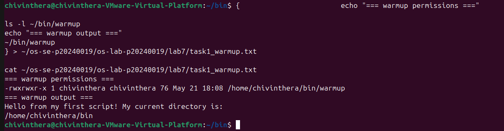
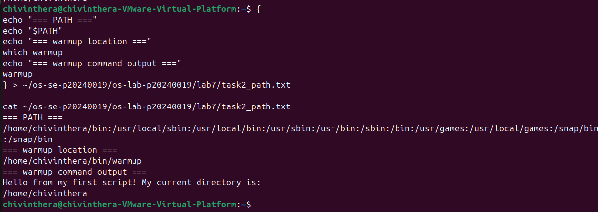
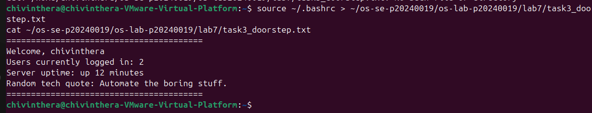
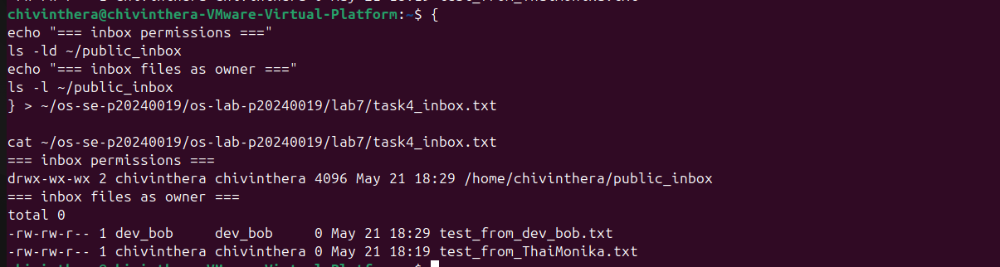
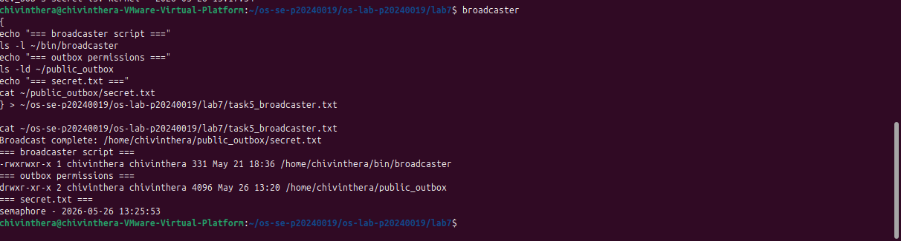
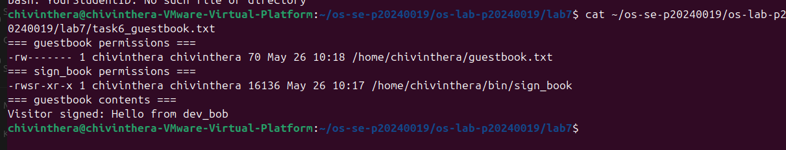
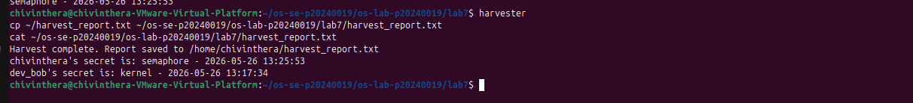
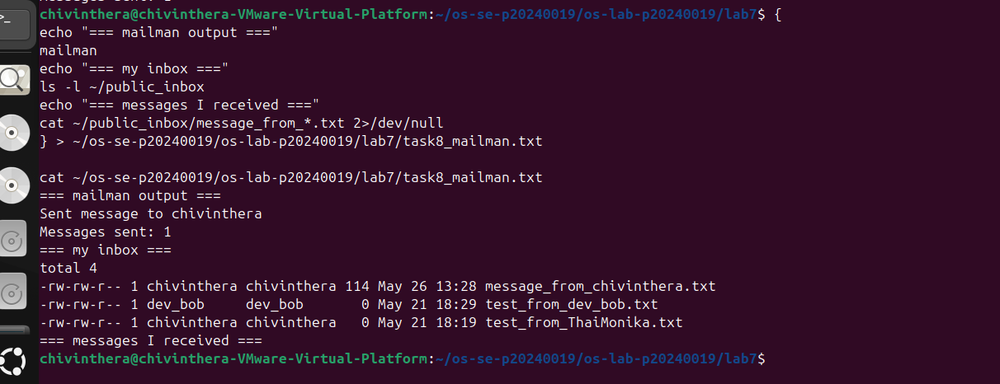

Here's your completed README.md:

---

# OS Lab 7 Submission — Bash Scripting, Permissions & Server Automation
- **Student Name:** Chiv Inthera
- **Student ID:** p20240019

---

## Task Output Files
Make sure all of the following files are present in your `lab7/` folder:
- [x] `task1_warmup.txt`
- [x] `task2_path.txt`
- [x] `task3_doorstep.txt`
- [x] `task4_inbox.txt`
- [x] `task5_broadcaster.txt`
- [x] `task6_guestbook.txt`
- [x] `harvest_report.txt`
- [x] `task8_mailman.txt`
- [x] `sign_book.c`
- [x] `scripts/warmup`
- [x] `scripts/broadcaster`
- [x] `scripts/harvester`
- [x] `scripts/mailman`
- [x] `scripts/sign_book_binary`

---

## Screenshots

### Screenshot 1 — Task 1: Warm-Up Script
Show `cat task1_warmup.txt` with the executable `warmup` script and successful output.

---

### Screenshot 2 — Task 2: PATH Setup
Show `cat task2_path.txt` with your `PATH`, `which warmup`, and running `warmup` by name.

---

### Screenshot 3 — Task 3: Doorstep Message
Show `cat task3_doorstep.txt` with username, users online, uptime, and random quote.

---

### Screenshot 4 — Task 4: Secure Mailbox
Show `cat task4_inbox.txt` with `public_inbox` permissions and a test file from a classmate.

---

### Screenshot 5 — Task 5: Broadcaster
Show `cat task5_broadcaster.txt` with the broadcaster script evidence and `secret.txt`.

---

### Screenshot 6 — Task 6: VIP Guestbook
Show `cat task6_guestbook.txt` with guestbook permissions, SUID binary permissions, and guestbook contents.

---

### Screenshot 7 — Task 7: Data Harvester
Show `cat harvest_report.txt` containing secrets collected from classmates.

---

### Screenshot 8 — Task 8: Mailman Bot
Show `cat task8_mailman.txt` with mailman output and messages received in your inbox.

---

## Answers to Lab Questions

1. **Why did `warmup` fail before you added execute permission?**
   > Linux requires a file to have the execute permission bit set before it can be run as a program. Without `chmod +x`, the kernel refuses to execute the file even if it contains a valid script. The permission bits control what operations are allowed on a file, and execution is a separate permission from reading or writing.

2. **What does adding `~/bin` to `PATH` allow you to do?**
   > Adding `~/bin` to `PATH` allows you to run scripts stored in that directory by typing just their name from anywhere in the system, without needing to type the full path like `/home/chivinthera/bin/warmup` or a relative path like `./warmup`. The shell searches every directory listed in `PATH` in order when you type a command, so putting `~/bin` at the front means your personal scripts are found first.

3. **Why does `chmod 733 public_inbox` allow classmates to drop files but not list the inbox?**
   > Permission `733` gives others write and execute permission on the directory, but not read permission. In Linux, read permission on a directory allows listing its contents with `ls`, while write and execute permission allows creating new files inside it. Without read permission, a user can drop a file in but cannot see what files already exist there, which protects the privacy of other people's messages.

4. **Why does Linux ignore SUID on shell scripts, and why did we use a compiled C program instead?**
   > Linux intentionally ignores the SUID bit on shell scripts for security reasons. A shell script is interpreted by a program like Bash, and allowing SUID scripts would create serious vulnerabilities through race conditions and interpreter manipulation. A compiled C program is a standalone binary that the kernel executes directly, so the kernel can safely apply the SUID bit and switch the effective user ID to the file's owner before running the program.

5. **What is the difference between `>` and `>>` in Bash redirection?**
   > The `>` operator overwrites the destination file completely each time it is used, deleting any existing content and starting fresh. The `>>` operator appends to the end of the file, preserving existing content and adding new output after it. For example, the broadcaster uses `>` to replace the secret each time it runs, while the harvester uses `>>` to build up a report by adding one line per user.

6. **How did your `harvester` avoid reading files that were missing or not readable?**
   > The harvester used an `if` condition with two checks before attempting to read any file: `[ -f "$target_file" ]` verifies that the file exists and is a regular file, and `[ -r "$target_file" ]` verifies that the current user has read permission on it. Only if both conditions are true does the script proceed to read the file with `cat`. This prevents errors from missing files or permission-denied situations silently breaking the script.

7. **What permission problems did you or your classmates need to fix during the lab?**
   > Several permission issues came up during the lab. The broadcaster script initially lacked execute permission and had to be fixed with `chmod +x`. The `public_outbox` directory was missing and had to be created with `chmod 755` so others could read from it. The home directory needed `chmod 711` so that other users could traverse into it to reach the `bin` directory and `sign_book` binary. The `guestbook.txt` had to be set to `chmod 622` temporarily so the SUID binary could write to it from another user's context. dev_bob's home directory also needed `chmod 711` so the harvester could read their `public_outbox/secret.txt`.

---

## Reflection

> This lab demonstrated how Linux permissions, shell scripting, and automation work together in a shared server environment. Setting up the public inbox, outbox, and guestbook showed that fine-grained permission control — down to the individual read, write, and execute bits — is essential for building secure systems where users can interact safely without exposing private data. Writing the harvester and mailman scripts showed how automation can span across multiple users and directories, and how even a simple loop with permission checks can simulate real server-side bots. The SUID task in particular highlighted why Linux has different rules for scripts versus compiled binaries, which reflects real security considerations in production systems. Overall the lab connected abstract permission concepts to practical, working automation on a live Linux machine.

