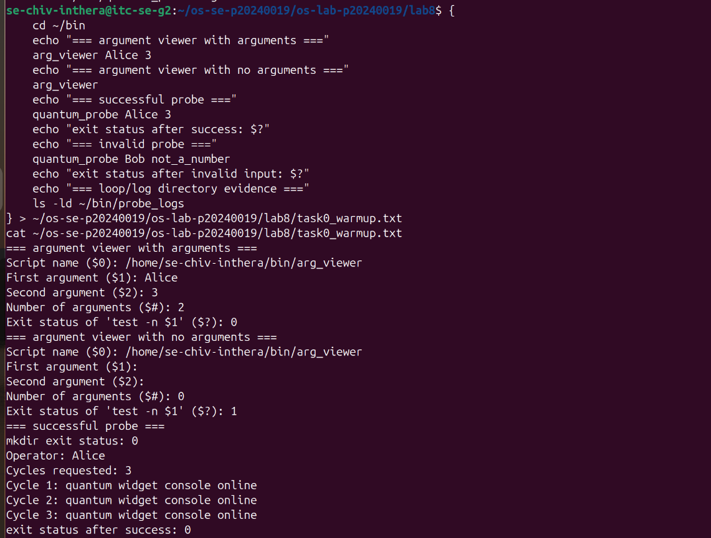
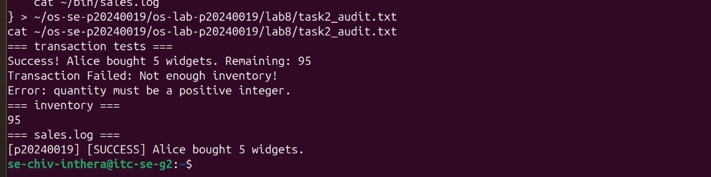
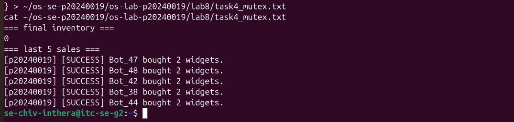
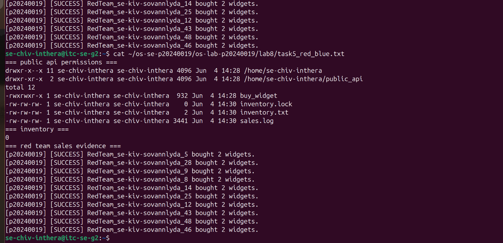
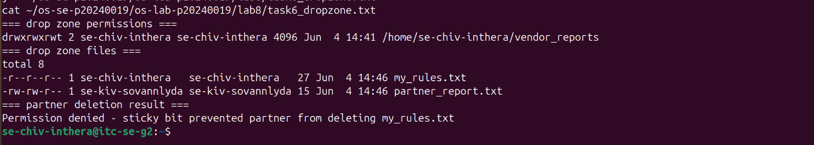
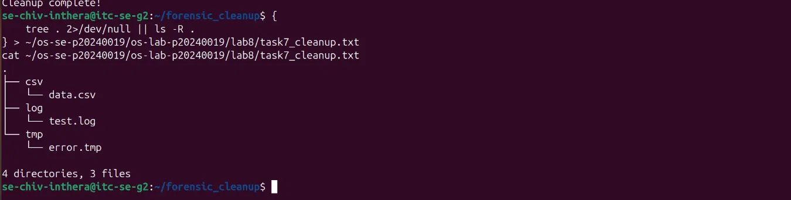

# OS Lab 8 Submission - The Quantum Widget Exploit
- **Student Name:** Chiv Inthera
- **Student ID:** p20240019
- **Partner Username:** se-kiv-sovannlyda

---

## Task Output Files
- [x] `observations.txt`
- [x] `task0_warmup.txt`
- [x] `task1_validation.txt`
- [x] `task2_audit.txt`
- [x] `task4_mutex.txt`
- [x] `task5_red_blue.txt`
- [x] `task6_dropzone.txt`
- [x] `task7_cleanup.txt`
- [x] `scripts/arg_viewer`
- [x] `scripts/quantum_probe`
- [x] `scripts/buy_widget`
- [x] `scripts/bot_swarm`
- [x] `scripts/create_dropzone`
- [x] `scripts/cleanup`

---

## Screenshots

### Screenshot 1 - Level 0: Bash Warm-Up Scripts
Show `arg_viewer` explaining `$0`, `$1`, `$2`, `$#`, and `$?`, then show `quantum_probe` using a condition and a loop.

---

### Screenshot 2 - Level 2: Audit Trails
Show input validation, a successful sale, failed transactions, final inventory, and `sales.log`.

---

### Screenshot 3 - Level 4: Mutex Patch
Show `inventory.txt` exactly `0` after the patched `bot_swarm`, plus the last five lines of `sales.log`.

---

### Screenshot 4 - Level 5: Red Team vs. Blue Team
Show `public_api` permissions, inventory, and sales log evidence that your classmate executed your API.

---

### Screenshot 5 - Level 6: Secure Drop Zone
Show the sticky bit in `ls -ld` output and evidence that your partner could not delete your file.

---

### Screenshot 6 - Level 7: Forensic Cleanup
Show `tree` or `ls -R` output proving `.log`, `.csv`, and `.tmp` files were sorted into folders.

---

## Race Condition Observations
| Run | Final Inventory | Notes |
|:---:|----------------:|-------|
| 1 | -2 | Inventory went negative due to race condition |
| 2 | -2 | Inventory went negative due to race condition |
| 3 | -2 | Inventory went negative due to race condition |
| 4 | -2 | Inventory went negative due to race condition |
| 5 | -2 | Inventory went negative due to race condition |

---

## Answers to Lab Questions

1. **In `arg_viewer`, what did `$0`, `$1`, `$2`, `$#`, and `$?` mean when you ran the script?**
   > `$0` is the script name, `$1` is the first argument, `$2` is the second argument, `$#` is the total number of arguments, and `$?` is the exit status of the last command.

2. **What does TOC-TOU mean, and where did it appear in the vulnerable `buy_widget` script?**
   > TOC-TOU means Time-of-Check to Time-of-Use. It appeared when multiple bots read the inventory at the same time before any of them wrote the updated value back, causing incorrect results.

3. **Why did `bot_swarm` sometimes leave inventory values other than `0` before the patch?**
   > Because 50 processes ran at the same time and all read the same inventory value before anyone updated it. This caused some purchases to overlap and the final count to be wrong.

4. **What part of the script is the critical section, and why must it be protected?**
   > The critical section is the part that reads inventory, checks availability, writes the new inventory, and logs the transaction. It must be protected so only one process can run it at a time.

5. **How does `flock -x` enforce mutual exclusion between concurrent processes?**
   > `flock -x` locks a file so only one process can hold the lock at a time. Other processes must wait until the lock is released before they can enter the critical section.

6. **Which permissions did you use to let a classmate run your API without giving full access to your home directory?**
   > I used `chmod o+x` on my home directory, `chmod 755` on `public_api`, and `chmod o+rx` on `buy_widget`. This lets others execute the script without accessing my home directory files.

7. **Why does the sticky bit protect files in a shared drop zone?**
   > The sticky bit means only the file owner can delete their own files, even if the directory is writable by everyone. So partners can add files but cannot delete each other's files.

8. **What defensive scripting practice from this lab would you use in a real production script?**
   > I would always use `flock` to protect shared file updates, validate all user input before processing, and use absolute paths so scripts work correctly from any directory.

---

## Reflection
> This lab taught me that Bash scripts running at the same time can corrupt shared data if not properly protected. OS scheduling means processes can interrupt each other at any moment. Using `flock` for mutual exclusion and setting correct file permissions are essential practices for writing safe and secure scripts in a real environment.