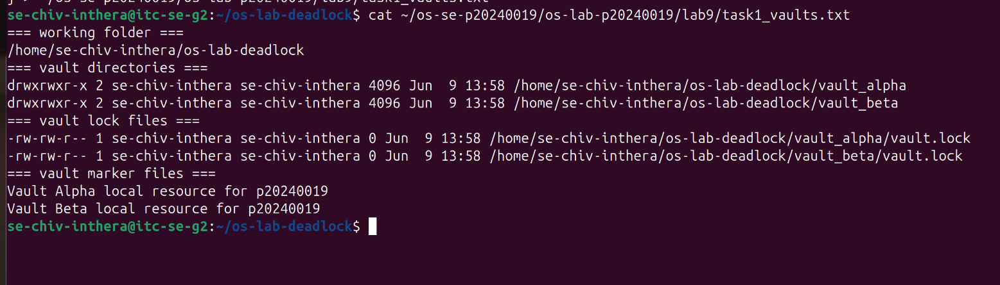
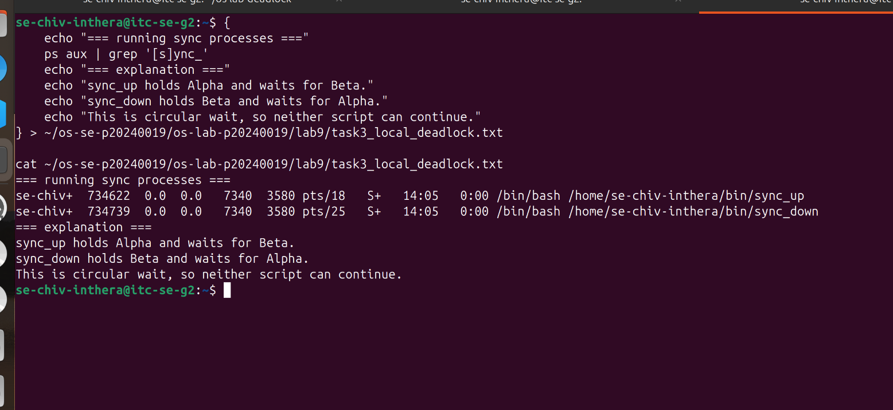
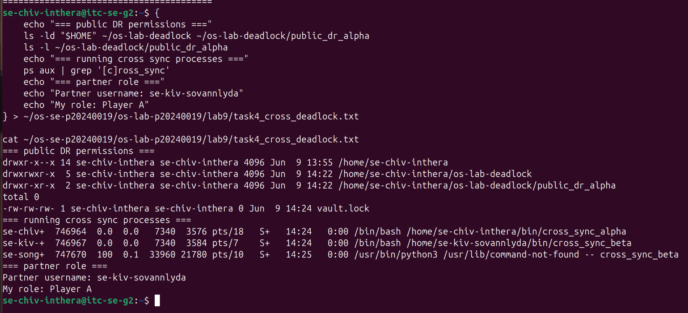
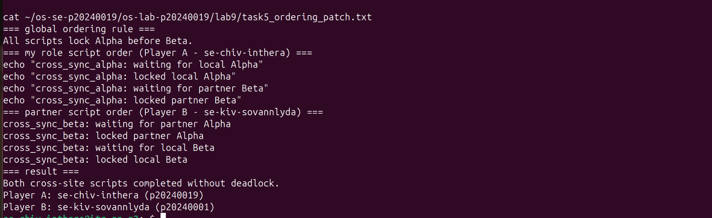
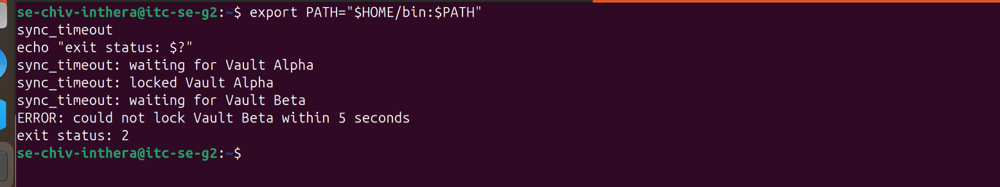
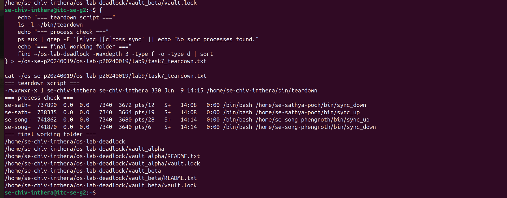

# OS Lab 9 Submission - The Quantum Vault Deadlock
- **Student Name:** Chiv Inthera
- **Student ID:** p20240019
- **Linux Username:** se-chiv-inthera
- **Partner Username:** se-kiv-sovannlyda
- **My Role:** Player A

---

## Required Working Files Outside the Repo

Confirm these files and folders existed while you ran the lab:

- [x] `~/bin/sync_up`
- [x] `~/bin/sync_down`
- [x] `~/bin/sync_timeout`
- [x] `~/bin/teardown`
- [x] `~/bin/cross_sync_alpha`
- [x] `~/os-lab-deadlock/README.md`
- [x] `~/os-lab-deadlock/vault_alpha/README.txt`
- [x] `~/os-lab-deadlock/vault_alpha/vault.lock`
- [x] `~/os-lab-deadlock/vault_beta/README.txt`
- [x] `~/os-lab-deadlock/vault_beta/vault.lock`
- [x] `~/os-lab-deadlock/public_dr_alpha/vault.lock`

---

## Task Output Files

Make sure all of the following files are present in your `lab9/` folder:

- [x] `task1_vaults.txt`
- [x] `task2_sync_scripts.txt`
- [x] `task3_local_deadlock.txt`
- [x] `task4_cross_deadlock.txt`
- [x] `task5_ordering_patch.txt`
- [x] `task6_timeout_recovery.txt`
- [x] `task7_teardown.txt`
- [x] `scripts/sync_up`
- [x] `scripts/sync_down`
- [x] `scripts/sync_timeout`
- [x] `scripts/teardown`
- [x] `scripts/cross_sync_alpha`

---

## Screenshots

Insert your screenshots below.

### Screenshot 1 - Level 1: Vault Workspace Setup
Show `vault_alpha`, `vault_beta`, and their `vault.lock` files.

---

### Screenshot 2 - Level 3: Local Deadlock
Show frozen `sync_up` and `sync_down` terminals or process evidence.

---

### Screenshot 3 - Level 4: Site-to-Site Deadlock
Show partner cross-site scripts frozen in circular wait.

---

### Screenshot 4 - Level 5: Global Resource Ordering Patch
Show ordered locking completing without deadlock.

---

### Screenshot 5 - Level 6: Timeout Recovery
Show the timeout error and nonzero exit status.

---

### Screenshot 6 - Level 7: Cleanup and Reset
Show the process check and final working tree.

---

## Deadlock Observation Table

| Level | Script A Held | Script A Waited For | Script B Held | Script B Waited For | Result |
|:----:|---------------|---------------------|---------------|---------------------|--------|
| 3 | Vault Alpha | Vault Beta | Vault Beta | Vault Alpha | Deadlock - both scripts froze forever |
| 4 | public_dr_alpha | public_dr_beta | public_dr_beta | public_dr_alpha | Deadlock - both scripts froze forever |
| 5 | public_dr_alpha | public_dr_beta | public_dr_alpha | public_dr_beta | No deadlock - both scripts completed |

---

## Answers to Lab Questions

1. **What does each `vault.lock` file represent in this lab?**
   > Each `vault.lock` file represents a shared resource. A script must lock it before accessing the vault, just like a process must acquire a resource before using it.

2. **Why does `flock` require every script to lock the same shared file to coordinate correctly?**
   > Because `flock` works by locking a specific file. If two scripts lock different files, they do not block each other and cannot coordinate access to the same resource.

3. **In the local deadlock, which resource did `sync_up` hold, and which resource did it wait for?**
   > `sync_up` held Vault Alpha and waited for Vault Beta.

4. **In the local deadlock, which resource did `sync_down` hold, and which resource did it wait for?**
   > `sync_down` held Vault Beta and waited for Vault Alpha.

5. **Which four deadlock conditions were present in Level 3?**
   > Mutual exclusion: only one script can hold a lock at a time. Hold and wait: each script held one lock and waited for another. No preemption: locks could not be taken away forcefully. Circular wait: sync_up waited for sync_down and sync_down waited for sync_up.

6. **How does the global Alpha-before-Beta ordering rule break circular wait?**
   > When every script locks Alpha first then Beta, no script can hold Beta and wait for Alpha. This removes the circular wait condition so deadlock cannot happen.

7. **Why is `flock -w` useful for recovery even though it does not prevent every deadlock?**
   > Because it sets a time limit on waiting. If a script cannot get the lock within the timeout, it exits with an error instead of waiting forever, which prevents the system from getting permanently stuck.

8. **Why should you check for stuck processes before finishing a deadlock lab?**
   > Because stuck processes keep holding locks. If they are not stopped, they block other scripts from running and leave the system in a broken state.

---

## Reflection

> This lab taught me that deadlock happens when two processes each hold a resource the other needs. I learned how to use `flock` to simulate exclusive access and how circular wait causes scripts to freeze forever. The global ordering rule showed me that a simple rule like always locking Alpha before Beta is enough to prevent deadlock. Timeout recovery with `flock -w` taught me that a script should never wait forever for a resource. Overall this lab made deadlock feel very real and showed me practical ways to prevent and recover from it.